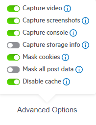

# Advanced Capture Options

Fiddler Jam provides several advanced capture options. These options allow you to enable or disable certain functionalities in order to modify the recorded output:

- [Take screenshots while capturing](#take-screenshots-while-capturing)
- [Capture console](#capture-console)
- [Mask cookies](#mask-cookies)
- [Mask all post data](#mask-all-post-data)
- [Disable Cache](#disable-cache)
- [Capture storage info](#capture-storage-info)
- [Capture video](#capture-video)

## Advanced Options

### Take screenshots while capturing

This option will take a screenshot of each user's activities during the capturing process. Each screenshot will be added to the ongoing recording as a PNG file. The activities that trigger a screenshot are clickable actions (buttons, links), interactions with forms, etc. By default, **Take screenshots while capturing** is **enabled**.

>important The screenshots are available only when accessing the recorded log through [the Fiddler Jam portal](). A recorded log exported as HAR or opened directly in [Fiddler Everywhere](https://www.telerik.com/download/fiddler-everywhere) won't contain screenshots.

### Capture console

When enabled, the capturing includes everything outputted in the developer console, including the log and available stack traces. The option is **enabled** by default.

>important The console logs are available only when accessing the recorded log through [the Fiddler Jam portal](). A recorded log exported as HAR or opened directly in [Fiddler Everywhere](https://www.telerik.com/download/fiddler-everywhere) won't contain console logs.

### Mask cookies

When enabled, the Jam extension masks any cookies that are part of the captured requests and responses. Masking hides all cookie values while the cookie key names remain visible. The option is **enabled** by default.

### Mask all post data

When enabled, the Jam extension masks any post data (for example, data from forms, input text fields, etc.). Post data is also the request body sent via POST/PUT/PATCH methods. The option is **disabled** by default.

>important By default, when the option **Mask all post data** is disabled all data that is considered sensitive is masked. Enabling the option will explicitly mask all POST data (sensitive or not). Learn more about what does Fiddler Jam considers as sensitive data in our [dedicated security article](#masking-sensitive-data).

### Disable cache

When enabled, the Jam extension sets the value of the `Cache-Control` and `Prasgma` headers to `no-cache` on each network request.  The option is **enabled** by default.

### Capture storage info

When enabled, the Jam extension captures local or session storage data from each inspected Chrome tab. The storage info is then accessible through the **Storage Details** tab from the submitted log screen in the Jam portal. The option is **disabled** by default.

### Capture video

When enabled, the Jam extension captures video recording from the inspected Google Chrome tab. The video is then accessible through the **Screen recording** tab from the submitted log screen in the Jam portal. The option is **disabled** by default.

## Security concerns

Capturing all outgoing and incoming traffic for the current tab might expose sensitive or confidential data. Always consider the security aspect before sharing a recorded log. Learn more about [the security details when working with Fiddler Jam]().

## Next Steps

Learn more about:

- What is the [Fiddler Jam portal]().
- What is the difference between [Fiddler Jam portal user](#user-role), [Fiddler Jam portal viewer](#viewer-role) and how to become one.
- How to [work with submitted logs in the Fiddler Jam portal]().
- How to [organize received logs into portal workspaces]()
- How to [use the Fiddler Everywhere desktop application for deep-dive investigation of Jam logs]().
