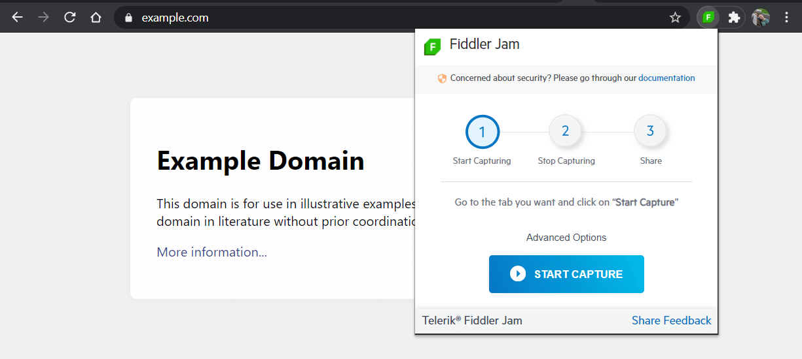

# Capture Options

Fiddler Jam provides several specific capture options. These options allow you to enable or disable certain functionalities in order to improve the recorded output.

## Take screenshots while capturing

This option will take a screenshot of each action the users do while capturing progress. Each screenshot will be added to the ongoing recording as a PNG file. The activities that will trigger a screenshot are clickable actions (buttons, following links), interactions with forms, etc. By default, the **_Take screenshots while capturing_** is **enabled**.

>important The screenshots will be available only when accessing the recorded log through [the Fiddler Jam portal](). A recorded log exported as HAR or opened directly in [FIddler Everywhere](https://www.telerik.com/download/fiddler-everywhere) won't contain screenshots.

## Capture console

This option will capture everything written in the developer console. By default, the **_Capture console_** is **enabled**.

>important The console logs will be available only when accessing the recorded log through [the Fiddler Jam portal](). A recorded log exported as HAR or opened directly in [FIddler Everywhere](https://www.telerik.com/download/fiddler-everywhere) won't contain console logs.

## Mask cookies

This option will mask any cookies that are part of the captured requests and responses. Note that the masking will hide all cookie values, while the cookie key names will remain visible. By default, the **_Mask cookies_** is **enabled**.

## Capture post data

This option will capture post data (for example, data from forms, input text fields, etc.). By default, the **_Capture post data_** is **disabled**.

## Security concerns

Capturing all outgoing and incoming traffic for the current tab might expose sensitive and/or confidential data. Always consider the security aspect before sharing a recorded log. Learn more about [the security details when working with Fiddler Jam]().