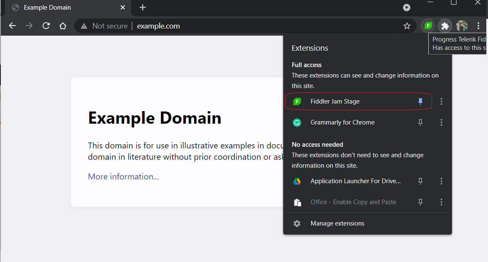
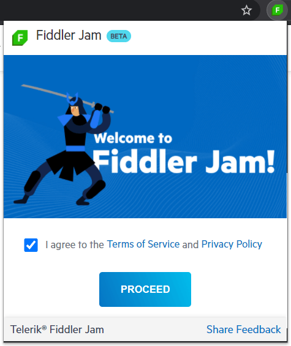

# Installation

**Fiddler Jam** is an extension for [Google Chrome](https://www.google.com/chrome/). The extension requires active internet connection with access to the following URL:

```
https://*.getfiddler.com/
https://*.amazonaws.com/
```

Add it to your browser by using the Chrome Web Store as described below.

## Install Fiddler Jam

1. Open the **Google Chrome** browser on your computer.
1. Open the [Chrome Web Store page for Fiddler Jam](https://chrome.google.com/webstore/detail/fiddler-jam/fnkjlegmkbicdodlheligomlfbdblpfj).
1. Click **Add to Chrome**.
1. On the confirmation popup, click **Add extension**.

>important You can't add Chrome extensions when you browse in Incognito mode or as a guest.

To use the extension, click the Fiddler Jam icon to the right of Chrome's address bar. If you have multiple extensions and the Fiddler Jam icon isn't visible, click the Chrome Extensions icon to reveal Fiddler Jam. You can also [pin Fiddler Jam](#pin-fiddler-jam) for faster access.

>tip You could [enable the extension to work in incognito mode](#enable-fiddler-jam-in-incognito-mode) after the installation.

## Pin Fiddler Jam

A pinned extension appears in the Chrome toolbar next to your profile avatar and allows for faster access. To pin the Fiddler Jam extension:

1. Click the **Extensions** button on the Google Chrome toolbar (next to your profile avatar).
1. Click the pin next to **Fiddler Jam** extension.



## Initial Jam Extension Screen

After а successful installation of the Fiddler Jam extension, the Welcome screen prompts the new user to read and accept the [Terms of Service](https://www.telerik.com/purchase/license-agreement/fiddler-jam-beta) and the [Privacy Policy](https://www.progress.com/legal/privacy-policy).




## Manage Extensions in Chrome

Some specific information and settings are accessible via the extension's management page:

- Click the **Extensions** button on the Google Chrome toolbar (next to your profile avatar).
- In the expanded menu, click **Manage Extensions**.
- Type **Fiddler Jam** in the search bar or directly select the **Fiddler Jam** extension.
- Click on the **Details** button.

On this management page, you could set Fiddler Jam [site access](#site-access) and the option to [work in incognito mode](#allow-in-incognito).

### Site Access

The **Site Access** extension settings provide the option to limit the extension for a specific site. The option **on click** is not applicable for the Fiddler Jam extension as it does not provides an opportunity to permit access to the mandatory backend endpoints. By default, most Chrome exceptions are available on all sites (using the option **On all sites**). 

To use Fiddler Jam on specific sites only, scroll down to **Site access**, select the **On specific site** option, and add the required endpoints:

```
<The URL of the specific site you will use alongside the Fiddler Jam extension>
https://api.getfiddler.com/](https://api.getfiddler.com/
https://fiddler-backend-production.s3-accelerate.amazonaws.com/
```

### Allow in Incognito

By default, most Chrome extensions are disabled in incognito mode. To explicitly enable Fiddler Jam and debug your sites in incognito mode, follow these steps:

1. Open the [management page](#manage-extensions-in-chrome).
1. Scroll down to **Allow in Incognito** and use the switch to enable the feature.


## Error Handling

In some cases your Fiddler Jam extension might experience issues while capturing or trying to submit a log. To resolve such issues follow [the error handling instructions](#error-handling).