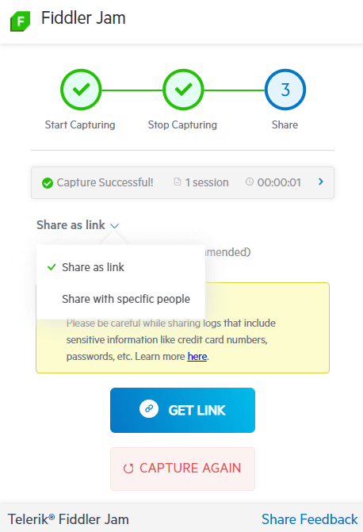
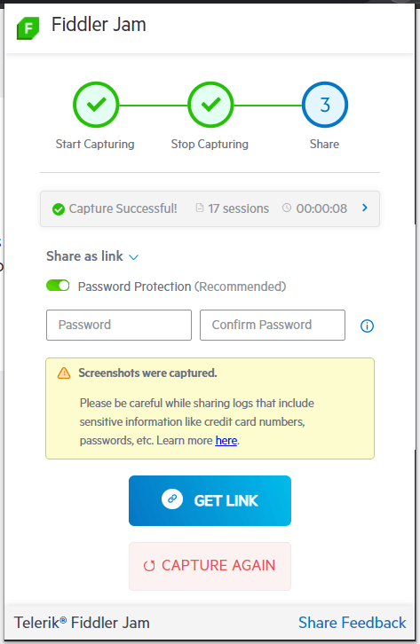
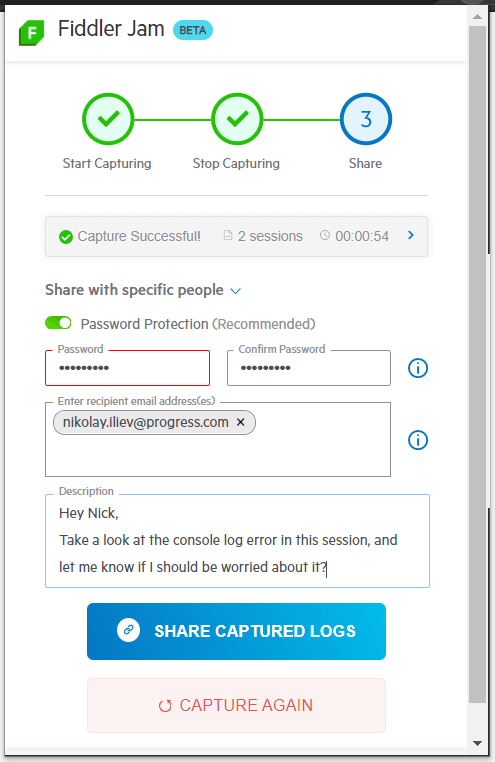

# Sharing Options

The Fiddler Jam extension provides two options for sharing [recorded logs](). Both alternatives allow additional security via [password protection](#password-protection-for-recorded-logs).

- [Share with a link](#share-with-a-link)
- [Share with specific people](#share-with-specific-people)

## Share with a Link

Link sharing allows [registered Fiddler Jam portal users](#portal-users) to open a recorded log, if they have the link. The log can be additionally [protected with a password](#password-protection-for-recorded-logs).

Only registered [Fiddler Jam portal users](#portal-users) with the appropriate rights will have access to the recorded information.

## Share with specific people

This option allows you to list specific users via their emails. Only users explicitly listed in the email list will be able to open the recorded log. Additionally, the log could be protected with a password by enabling the **Password protection** switch. The password must be at least eight characters long, must contain at least one lowercase, one uppercase, and one number.

The email recipients need to be [Fiddler Jam portal users](#portal-users) with the appropriate rights.

## Next Steps

Learn more about:

- What is the [Fiddler Jam portal]().
- What is a [Fiddler Jam portal user](#portal-users) and how to become one.
- How to [work with submitted logs in the Fiddler Jam portal]().
- How to [organize received logs into portal workspaces]()
- How to [use the Fiddler Everywhere desktop application for deep-dive investigation of Jam logs]().
