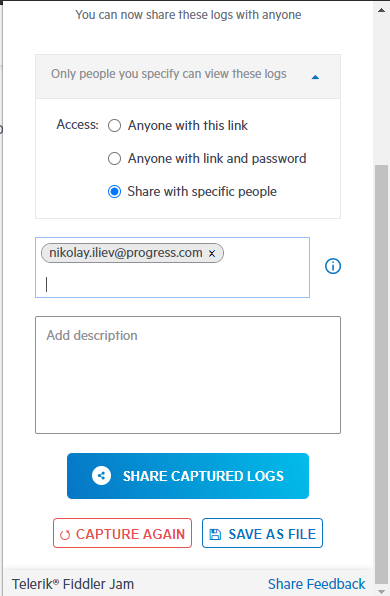

# Link Options

After [recording a log](), the Fiddler Jam extension provides several options for setting the log accessibility through the generated link. Use the **Link Options** drop-down to generate a sharable log with the proper access level.

- [Anyone with this link](#anyone-with-this-link)
- [Anyone with link and password](#anyone-with-link-and-password)
- [Share with specific people](#share-with-specific-people)

## Anyone with this link

The option allows any Fiddler Jam portal user to open the recorded logs. Only portal users will have full access to the recorded information. Extensions users will be able to see limited information from the recorded logs.

## Anyone with link and password

This option provides the option to protect your recorded log with your password. The content will be encrypted with AES-CTR, and only portal users with the password will be able to open the recorded log.

>tip The password needs to be at least eight characters long and contain at least one lowercase letter, one uppercase letter, and one number!

## Share with specific people

This option allows you to list specific users via their emails. Only users explicitly listed in the email list will be able to open the recorded log. The recipients need to be portal users in the Fiddler Jam portal.

