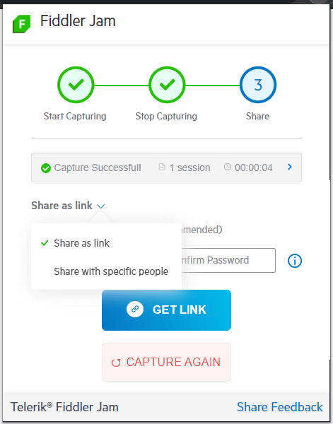

# Sharing Options

The Fiddler Jam extension provides two options for sharing [recorded logs](). Both alternatives allow additional security via [password protection](#password-protection-for-recorded-logs).

- [Share with a link](#share-with-a-link)
- [Share with specific people](#share-with-specific-people)

## Share with a Link

Link sharing allows [registered Fiddler Jam portal users](#portal-users) to open a recorded log, if they have the link. The log can be additionally [protected with a password](#password-protection-for-recorded-logs).

Only registered [Fiddler Jam portal users](#portal-users) with the appropriate rights will have access to the recorded information.

## Share with Specific People

This option allows you to list specific [Fiddler Jam portal users](#portal-users) via their account emails. Only users from the email list will be able to open the recorded log. The log can also be [protected with a password](#password-protection-for-recorded-logs).

## Password Protection for Recorded Logs

Recorded logs can be protected with a password, no matter if they are shared with a link or with specific users. Use the **Password protection** switch. The password must:

* be at least 8 characters long
* contain both lowercase and uppercase letters
* contain at least one number

## Next Steps

Learn more about:

- What is the [Fiddler Jam portal]().
- What is a [Fiddler Jam portal user](#portal-users) and how to become one.
- How to [work with submitted logs in the Fiddler Jam portal]().
- How to [organize received logs into portal workspaces]()
- How to [use the Fiddler Everywhere desktop application for deep-dive investigation of Jam logs]().
