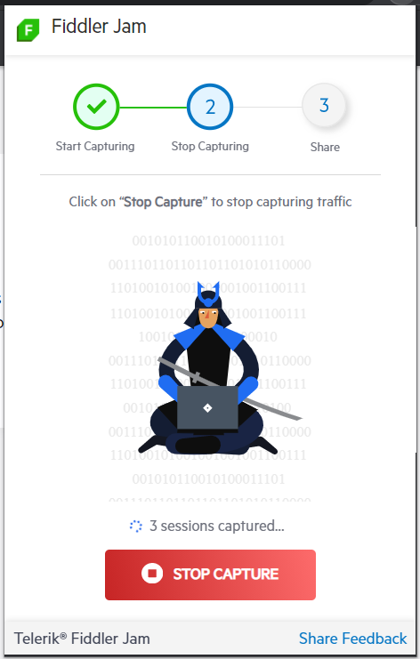

# Recording a Log

Log recording is the core functionality provided by Fiddler Jam. A **Log** in Fiddler Jam's context is a collection of captured HTTP(S) sessions, screenshots, console logs, and other information recorded by the user. To record the network traffic of the focused browser tab, follow these steps:

1. Launch **Fiddler Jam** by clicking on the extension icon .

2. Expand the [**Capture Options**]() and choose the preferred settings.

3. Click **Start Capture** to begin recording. Fiddler Jam will start recording all network activity in your current browser tab.

   

   >important Chrome displays an informational banner: **"Fiddler Jam" started debugging this browser**. Closing the notification or clicking **Cancel** won't stop the capturing session. Use the **Stop Capture** button (see the 5th step) to cancel an ongoing recording.

4. Click anywhere in the browser tab to hide the Fiddler Jam window and to continue recording. To bring the Fiddler Jam window back, click the extension's icon.

   At any time during recording, you can click **_Capturing…_** to see details about what Fiddler Jam records.

   

5. Click  **Stop Capture** to end the recording.

   

   At this point, the captured traffic is recorded as a log but is not yet saved anywhere. Proceed with [submitting the recorded log to the JAM portal](#submit-via-link) or by [saving the log as a file](#save-as-file).

## Additional Recording Options

During log recording, Fiddler Jam can capture not only the traffic but also:

- **Screenshots**: If the **_Take screenshots while capturing_** switch is enabled, a screenshot will be recorded every time you click on the loaded page.

- **Console logs**: If the **_Capture console_** switch is enabled, the log will contain all console logs executed from the source code.

>tip To reset the Fiddler Jam extension and start a new capturing session, use the **Capture Again** button.

Additionally, Fiddler Jam provides switches for masking cookies, post data and for disabling the cache from [the Capture options]().

## Next Steps

Learn more about:

- How to [submit the log I have just recored]().
- What is the [Fiddler Jam portal]().
- What is a [Fiddler Jam portal user](#portal-users) and how to become one.
- How to [work with submitted logs in the Fiddler Jam portal]().
- How to [organize received logs into portal workspaces]()
- How to [use the Fiddler Everywhere desktop application for deep-dive investigation of Jam logs]().