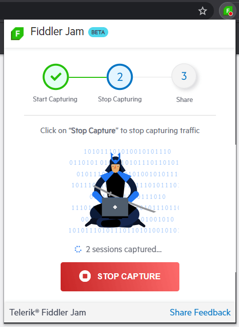

# Recording a Log

Log recording is the core functionality provided by Fiddler Jam. A **Log** in Fiddler Jam's context is a collection of captured HTTP(S) sessions, screenshots, console logs, and other information recorded by the user. To record the network traffic of the focused browser tab, follow these steps:

1. Launch **Fiddler Jam** by clicking on the extension icon .
1. (Optional) Expand [**Advanced Options**]() and enable the preferred settings. Use these options to control the exposed data, create screenshots, capture video recording, add local storage info, etc.
1. Click **Start Capture** to start recording. Fiddler Jam will record all network activity in your current browser tab. Click anywhere in the browser tab to hide the Fiddler Jam window and continue recording. To show the Fiddler Jam window back, click the extension's icon.

   
   >important Chrome displays an informational banner: **"Fiddler Jam" started debugging this browser**. Closing the notification or clicking **Cancel** won't stop the capturing session. Use the **Stop Capture** button (see the next step) to cancel an ongoing recording.   
1. Click  **Stop Capture** to end the recording.

   

   >tip The maximum size of a recorded Fiddler Jam log is 50MB.
1. Before submitting the recorded log, you can review it by clicking on the **Capture Successful** line. The **Capture Details** screen will load with a list of the captured sessions, screenshots, console logs, etc. Go back to the previous screen to generate a link and submit the log to the cloud portal.

   
1. At this point, the captured traffic is recorded as a log but is not yet submitted and saved in the Fiddler Jam portal cloud space. Choose the appropriate [**Sharing Options**](), use the **Get Link** button to proceed with [submitting and saving the recorded log to the JAM portal](#submit-via-link).

   

## Additional Recording Options

During recording, Fiddler Jam monitors the HTTP/HTTPS traffic, but it can also capture:

- **Screenshots**: If the **Capture screenshots** switch is enabled, a screenshot will be recorded every time you click on the loaded page.

- **Console logs**: If the **Capture console** switch is enabled, the log will contain all console logs executed from the source code.

>tip To reset the Fiddler Jam extension and start a new capturing session, use the **Capture Again** button.

Additionally, the Fiddler Jam [advanced options]() allow you to mask cookies, post data and disable the browser cache.

## Next Steps

Learn more about:

- [The available sharing options and password-protection of recoreded logs.]()
- How to [submit the log I have just recored]().
- What is the [Fiddler Jam portal]().
- What is a [Fiddler Jam portal user](#portal-users) and how to become one.
- How to [work with submitted logs in the Fiddler Jam portal]().
- How to [organize received logs into portal workspaces]()
- How to [use the Fiddler Everywhere desktop application for deep-dive investigation of Jam logs]().
