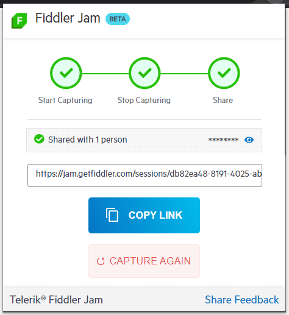

# Submitting a Log

Logs captured by the Fiddler Jam extension can be submitted to the [Fiddler Jam portal](), shared with portal users via email, or saved as a [JSON-formatted archive (**HAR**)](https://en.wikipedia.org/wiki/HAR_(file_format)).

## Submit via Link

Collaboration is the main feature of Fiddler Jam. You can easily submit a log in a few steps:

1. [Record a log]().

2. From the [**Link Generation options**](), select the access level you would like to apply to the recorded logs.

   The default drop-down selection is **Anyone with this link**. You could also create a password-protected link by using the **Anyone with link and password** option or share the recorded logs with specific people via email by using the **Share with specific people** option.

    - If you selected **Anyone with this link** or **Anyone with link and password**: Click **Get Link** to submit the generated log. This generates a sharable link for the current user. Simultaneously, the log is uploaded to the Fiddler Jam cloud.

    - If you selected **Share with specific people**: Click **Share Captured Logs** to submit the generated log. This sends an email notification to the specified recipients and then generates a shareable link. Simultaneously, the log is uploaded to the Fiddler Jam cloud. Only the log creator and the specified recipients can view the log.

3. Click **Copy Link** to store the unique URL to your machine's clipboard. Use this link to share the recorded logs with other Fiddler Jam [portal users](#portal-users).

>tip Logs submitted to the Fiddler Jam portal **are private**. Only Fiddler Jam [portal users](#portal-users) with [the proper access rights]() are able to open a submitted log.

## Next Steps

Learn more about:

- What is the [Fiddler Jam portal]().
- What is a [Fiddler Jam portal user](#portal-users) and how to become one.
- How to [work with submitted logs in the Fiddler Jam portal]().
- How to [organize received logs into portal workspaces]()
- How to [use the Fiddler Everywhere desktop application for deep-dive investigation of Jam logs]().
