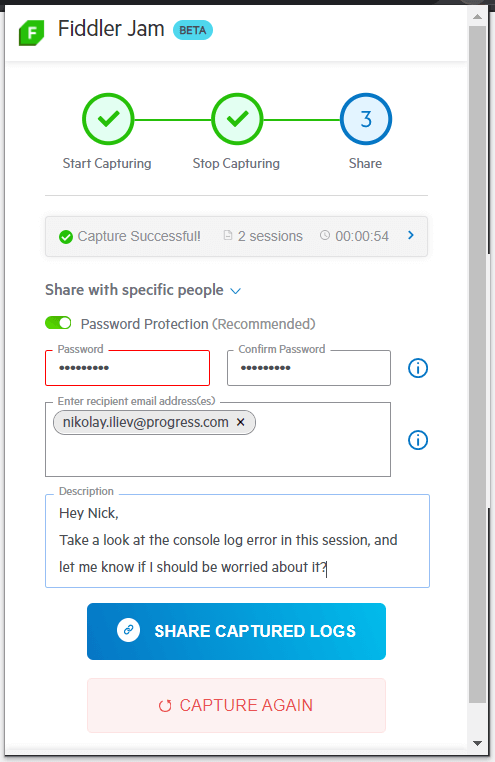

# Submitting a Log

Fiddler Jam logs can be submitted to the [Fiddler Jam portal]() and shared with portal users via email or a direct link.

## Submit via Link

Collaboration is the main feature of Fiddler Jam. You can easily submit a log in a few steps:

1. [Record a log]().

2. From the [**Sharing options**](), set the access level for the recorded log (public or shared with specific people) and optionally [protect the log with a password](#password-protection-for-recorded-logs).

   The default drop-down selection is **Share with link**, which will create a public link. Click **Get Link** to submit the recorded Fiddler JAM log and generate a sharable link. The link points to the cloud space in the Jam portal that contains the submitted log. This URL is accessible only for Fiddler Jam [portal users](#portal-users) with the appropriate access rights.

   
   
   Alternatively, you could select **Share with specific people**, which will create a link only for the portal users added explicitly via their account email. Click **Share Captured Logs** to submit the recorded Fiddler JAM log. This action sends an email notification to the specified recipients and then generates a shareable link. Simultaneously, the log is uploaded to the Fiddler Jam cloud space. This URL is accessible only for Fiddler Jam [portal users](#portal-users) with the appropriate access rights.

   

3. Click **Copy Link** to store the unique URL to your machine's clipboard. Use this link to share the recorded logs with other Fiddler Jam [portal users](#portal-users).

>tip Logs submitted to the Fiddler Jam portal **are private**. Only Fiddler Jam [portal users](#portal-users) with [the proper access rights]() are able to open a submitted log.

## Error Handling

Submitting a Fiddler Jam log is an operation that requires access to specific API endpoints and specific access levels for the user that accesses the Internet through the browser. Some users might experience an issue while starting the extension, capturing traffic, or submitting a generated Fiddler Jam log. In case you are facing a similar scenario, follow the following steps:

- Verify that you have active Internet access

- Verify that you have access to the following test endpoint: [https://fiddler-backend-production.s3.amazonaws.com/connectivity-test/check.html](https://fiddler-backend-production.s3.amazonaws.com/connectivity-test/check.html)

In case the issue resides elsewhere, proceed with collecting the error data from your browser.

- Open [chrome://extensions/?id=fnkjlegmkbicdodlheligomlfbdblpf](chrome://extensions/?id=fnkjlegmkbicdodlheligomlfbdblpf). When the Fiddler Jam extension is installed the link will open the Fiddler Jam extension details page. Scroll down and enable the **Collect errors** toggle.

- Record and submit a test session, then open **chrome://extensions/** and send us a screenshot of the errors

   

- If no errors are shown in the **chrome://extensions/** screen, open the **background page** (from the **Manage extensions** page). A Chrome devtools console opens in another window. Go to the **Console** tab and again click the **Start capture** button. Log all errors that appear in the Chrome devtools console in an external file.

   

- Send the error logs and the screenshot to the [Fiddler Jam support team]().

## Next Steps

Learn more about:

- What is the [Fiddler Jam portal]().
- What is a [Fiddler Jam portal user](#portal-users) and how to become one.
- How to [work with submitted logs in the Fiddler Jam portal]().
- How to [organize received logs into portal workspaces]()
- How to [use the Fiddler Everywhere desktop application for deep-dive investigation of Jam logs]().