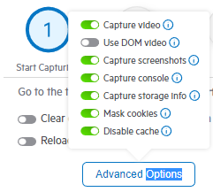

# Capturing Options

The Fiddler Jam Chrome Extension provides many configurable settings for capturing logs, which enable you to modify the recorded output. Some of these advanced capturing options are enabled or disabled by default. The capture options add tremendous flexibility to your log creation by providing you the power to choose what content should be available in the final output. The options are available on the extension start page and are organized as follows:

- [Clear cookies, cache, and storage on start](#clear-cookies-cache-and-storage-on-start)
- [Reload page on start](#reload-page-on-start)
- **Advanced Options** dropdown menu includes the following settings:
    * [Capture video](#capturing-videos)
    * [Use DOM Video](#using-dom-video)
    * [Capture screenshots](#capturing-screenshots)
    * [Capture console](#capturing-console-logs)
    * [Capture storage info](#capturing-storage-information)
    * [Mask cookies](#masking-cookies)
    * [Disable cache](#disabling-the-cache)

## Clear cookies, cache, and storage on start

The **Clear cookies, cache, and storage on start** option will effectively remove cookies, cache, and storage data from the starting page at the moment when the capture starts. By default, the **Clear cookies, cache, and storage on start** option is disabled.

## Reload page on start

The **Reload page on start** option will force reload the entry point URL when the capture starts. By default, the **Reload page on start** option is disabled.

## Capturing Videos

The **Capture video** option allows you to capture video recordings from the inspected Google Chrome tab. Only the tab from which the Fiddler Jam log recording has started will be recorded, and subsequently opened tabs won't be present in the video recording. The default video format is **Pixel-perfect** but the option can be combined with the [**Use DOM Video** option](#using-dom-video) to enable **DOM** video recording. [Learn more about the differences between both formats here...](#pixel-perfect-vs-dom-formats)

Consider the following when using the related video switches from the advanced options.

- **Capture video**: ON and **Use DOM video**: OFF&mdash;Records Pixel-perfect video
- **Capture video**: ON and **Use DOM video**: ON&mdash;Records Dom video 
- **Capture video**: OFF and **Use DOM video**: OFF&mdash;No video recording
- **Capture video**: OFF and **Use DOM video**; ON&mdash;No video recording

### Pixel-perfect vs DOM format

- **"DOM":** The DOM video recording produces a video that records all user activity except one from iframes. The main benefits of this recording type are the excellent browser compatibility, it supports masking sensitive data, and it doesn't require explicit permission from the user (the video recording starts immediately after calling the start() method).

- **"Pixel-perfect"**: The pixel-perfect video uses the native browser recording options. It produces a video that records all user activities and can be set to record different tabs, the whole screen, etc. It will also record video from nested iframes. The pixel-perfect recording requires explicit permission from the end-user (through a series of native popups).

### Submitted Videos

The submitted videos are accessible for Fiddler Jam Portal users only. A recorded log, exported as a HAR file or opened directly in [Fiddler Everywhere](https://www.telerik.com/download/fiddler-everywhere), won't contain the video recording. By default, the **Capture video** option is enabled.

The video recordings may contain and display sensitive input data, for example, data entered in forms, fields, and so on. Be careful when submitting sensitive data such as credit card information and passwords, and make sure you share them with trusted parties only. 

By design, the Jam extension will try to recognize and **mask sensitive data** in the output video recording. If your sensitive payment data is not automatically hidden in the output video, please use the [**Report Issue** portal functionality]() to report the case to the core Fiddler team.

## Using DOM Video

The **Use DOM Video** option (combined with active [**Capture Video** option](#capturing-videos)), changes the video format from pixel-perfect to DOM format. The main benefit of the DOM format is that it doesn't require explicit permission from the user.

## Capturing Screenshots

The **Capture screenshots** option allows you to take screenshots of user activity during the capturing process. Each screenshot is added to the ongoing recording as a PNG file. The user activities that trigger a screenshot are clickable actions (buttons, links), interactions with forms, and so on. The option is available for all Chromium-based browsers (Google Chrome, Edge, Brave, etc.) and Firefox. Screenshot capturing is currently unavailable for Safari.

The submitted screenshots are accessible for Fiddler Jam Portal users only. A recorded log, exported as a HAR file or opened directly in [Fiddler Everywhere](https://www.telerik.com/download/fiddler-everywhere), won't contain the screenshots. By default, the **Capture screenshots** option is enabled.

>important The screenshots may contain and display sensitive input data, for example, data entered in forms, fields, and so on. Be careful when submitting sensitive data such as credit card information and passwords, and make sure you share them with trusted parties only.

## Capturing Console Logs

The **Capture console** option enables you to capture the output in the developer console, including the log and the available stack traces.

The submitted console logs are accessible for Fiddler Jam Portal users only. A recorded log, exported as a HAR file or opened directly in [Fiddler Everywhere](https://www.telerik.com/download/fiddler-everywhere), won't contain the console logs. By default, the **Capture console** option is enabled.

## Capturing Storage Information

The **Capture storage info** option enables you to capture local or session storage data from each inspected Chrome tab.

The submitted storage information is accessible for Fiddler Jam Portal users only. By default, the **Capture storage info** option is enabled.

>important The storage information may contain and display sensitive input data, for example, data entered in forms, fields, and so on. Be careful when submitting sensitive data such as credit card information and passwords, and make sure you share them with trusted parties only.

## Masking Cookies

The **Mask cookies** option masks any cookies that are part of the captured requests and responses. The masking option hides all cookie values while the cookie key names remain visible. By default, the **Mask cookies** option is enabled.

## Disabling the Cache

The **Disable cache** option enables the Fiddler Jam Chrome Extension to set the value of the `Cache-Control` and `Pragma` headers to `no-cache` on each network request. By default, the **Disable cache** option is enabled.

