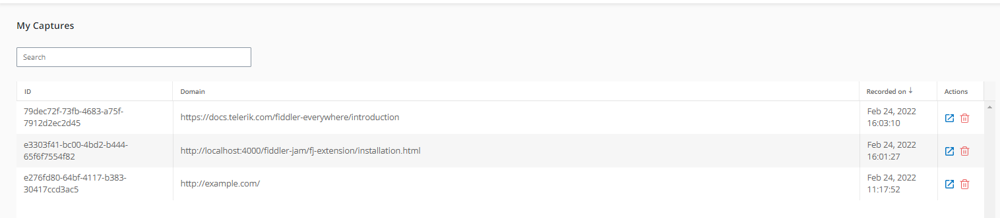

# Managing the Chrome Extension after Installation


## Extension Login

The Fiddler Jam extension can be used entirely anonymously without the explicit need for a user account and authentication. However, using a single account for the Fiddler Jam extension and Fiddler Jam portal provides the advantage of efficiently managing your previously captured logs through the [**My Captures** section](#my-captures). Authenticated users that have associated Jam portal accounts can directly [upload recorded logs to a Jam workspace](#upload-to-jam-portal-workspace).

Login into the Fiddler Jam extension as follows:

- Install and start the Fiddler Jam extension.
- Click on the account icon on the top-right corner of the extension.
- Login with your Fiddler Jam account.


## My Captures

The **My Captures** section provides easy access to previously recorded logs. The Fiddler Jam logs are listed in order by time of appearance, and each entry has the following options:

- A log entry can be viewed in the Fiddler Jam portal through the link button. Applicable only for [active portal users](#portal-users).
- A log entry can be **permanently** deleted through the delete button and an explicit deletion confirmation. 
    >important The deletion will remove the log for the extensions **My Captures** section and **any** Fiddler Jam portal workspace where the log was added. The deletion is permanent and irreversible.




Note that some of the functionalities like a quick link to the log to the Fiddler Jam portal are available only for [active portal users](#portal-users). However, the captured logs will be availalbe in the **My Captures** section for authenticated and unauthenticated users, and will remain on the machine unless deleted or explicitly removed from the machine storage.

## Jam Extension Browser Settings

After successfully installing the Fiddler Jam Chrome Extension, you can set its site access and allow it to work in the Incognito mode. To access the specific settings on the management page of the Fiddler Jam Chrome Extension:

1. Click the **Extensions** button on the Google Chrome toolbar next to your profile avatar.
1. In the expanded menu, click **Manage Extensions**.
1. Type **Fiddler Jam** in the search bar or directly select the Fiddler Jam Chrome Extension.
1. Click the **Details** button.

### Setting the Site Access

The **Site Access** Extension settings enable you to limit the extension for a specific site. The **on click** option is not applicable for the Fiddler Jam Chrome Extension as it does not allow you to permit access to the mandatory backend endpoints. Most Chrome exceptions are available on all sites, and you can manage them through the **On all sites** option.

To use Fiddler Jam on specific sites only, scroll down to **Site access**, select the **On specific site** option, and add the required endpoints:

```
// The URL of the specific site you will use alongside the Fiddler Jam extension.
https://api.getfiddler.com/](https://api.getfiddler.com/
https://fiddler-backend-production.s3-accelerate.amazonaws.com/
```

### Enabling the Incognito Mode

By default, most Chrome extensions are disabled in the Incognito mode. To explicitly enable Fiddler Jam and debug your sites in Incognito:

1. Open the management page of the Fiddler Jam Chrome Extension.
1. Scroll down to **Allow in Incognito** and use the switch to enable the feature.
