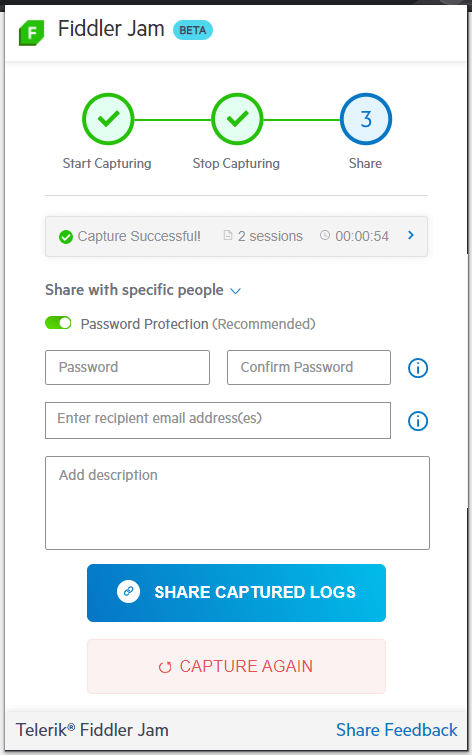

# Log Submit Options

The Fiddler Jam Chrome Extension enables you to submit the recorded logs either by sharing the generated link for that log, by sharing the log with specific people, or by directly uploading the recorded log to a workspace (available only for authenticated users). All alternatives allow you to provide additional security by setting a password.

When creating a log containing DOM video recording, you can also choose to upload only a specific video portion.

## Submitting Video Duration

When recording a video in [DOM format](#pixel-perfect-and-dom-formats), Fiddler Jam provides the option to submit only a portion of the recorded video. This way, you can protect sensitive data (like entered personal data, passwords, etc.) AND to avoid lengthy videos being uploaded to your organizational workspace (which could take more time to upload and spend networking resources).

Use the **Submit specific duration** option and set the minutes and seconds you would like to submit (leaves the last part of the video recording and crops the beginning).

## Sharing the Generated Link

Use the **Share as Link** option to generate a link that can be shared with [registered Fiddler Jam Portal users](#portal-users) and is not accessible to anonymous users (not public). After using the **Share as Link** option, the captured log (alongside all active capturing options like screenshots, video recordings, console logs, etc.) is uploaded to the Fiddler Jam cloud space. 

Additionally, you can protect the log with a password. Only Fiddler Jam Portal users who know the password can access the recorded information.

## Sharing the Log with Specific People

Use the **Sharing the Log with Specific People** option to share the recorded log with specific Fiddler Jam Portal users. Only [registered Fiddler Jam Portal users](#portal-users) from the particular email list will be able to open the recorded log. After using the **Sharing the Log with Specific People** option, the captured log (alongside all active capturing options like screenshots, video recordings, console logs, etc.) is uploaded to the Fiddler Jam cloud space.

Additionally, you can protect the log with a password. Only the specified Fiddler Jam Portal users who know the password will access the recorded information.

## Upload to Jam Portal Workspace

The option **Upload to a workspace** is available only for authenticated users that have associated [portal user](#portal-users) accounts. The recorded log uploads to a selected organizational workspace.

## Password Protection for Recorded Logs

All recorded logs can be protected with a password, whether shared with a link, specific users or directly uploaded to a company workspace.

To create a password for your recorded log, use the **Password protection** switch. The password requires you to consider that it has to:

* Be at least eight characters long.
* Contain both lowercase and uppercase letters.
* Contain at least a single number.

