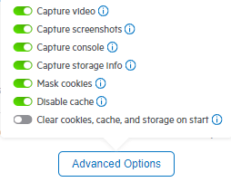

# Advanced Capturing Options

The Fiddler Jam Chrome Extension provides a number of advanced settings for capturing logs, which enable you to modify the recorded output.

Some of these advanced capturing options are enabled or disabled by default.

The **Advanced Options** menu includes the following settings:

- [Capture video](#capturing-videos)
- [Capture screenshots](#capturing-screenshots)
- [Capture console](#capturing-console-logs)
- [Capture storage info](#capturing-storage-information)
- [Mask cookies](#masking-cookies)
- [Mask all post data](#masking-all-post-data)
- [Disable cache](#disabling-the-cache)

## Capturing Videos

The **Capture video** option allows you to capture video recordings from the inspected Google Chrome tab. Note that only the tab from which the Fiddler Jam log recording has started will be recorded, and subsequently opened tabs won't be present in the video recording.

The submitted videos are accessible for Fiddler Jam Portal users only. A recorded log, exported as an HAR file or opened directly in [Fiddler Everywhere](https://www.telerik.com/download/fiddler-everywhere), won't contain the video recording.

By default, the **Capture video** option is enabled.

>important The video recordings may contain and display sensitive input data, for example, data entered in forms, fields, and so on. Be careful when submitting sensitive data such as credit card information and passwords, and make sure you share them with trusted parties only.

## Capturing Screenshots

The **Capture screenshot** option allows you to take a screenshot of a user activity that occurred during the capturing process. Each screenshot is added to the ongoing recording as a PNG file. The user activities that trigger a screenshot are clickable actions (buttons, links), interactions with forms, and so on.

The submitted screenshots are accessible for Fiddler Jam Portal users only. A recorded log, exported as an HAR file or opened directly in [Fiddler Everywhere](https://www.telerik.com/download/fiddler-everywhere), won't contain the screenshots.

By default, the **Capture screenshot** option is enabled.

>important The screenshots may contain and display sensitive input data, for example, data entered in forms, fields, and so on. Be careful when submitting sensitive data such as credit card information and passwords, and make sure you share them with trusted parties only.

## Capturing Console Logs

The **Capture console** option enables you to capture the output in the developer console, including the log and the available stack traces.

The submitted console logs are accessible for Fiddler Jam Portal users only. A recorded log, exported as an HAR file or opened directly in [Fiddler Everywhere](https://www.telerik.com/download/fiddler-everywhere), won't contain the console logs.

By default, **Capture console** is enabled.

## Capturing Storage Information

The **Capture storage info** option enables you to capture local or session storage data from each inspected Chrome tab.

The submitted storage information is accessible for Fiddler Jam Portal users only.

By default, **Capture storage info** is enabled.

>important The storage information may contain and display sensitive input data, for example, data entered in forms, fields, and so on. Be careful when submitting sensitive data such as credit card information and passwords, and make sure you share them with trusted parties only.

## Masking Cookies

The **Mask cookies** option masks any cookies that are part of the captured requests and responses. The masking option hides all cookie values while the cookie key names remain visible.

By default, **Mask cookies** is enabled.

## Masking All Post Data

The **Mask all post data** option masks any post data such as data from forms, input text fields, and so on. Post data is also the request body sent through the POST, PUT, and PATCH methods.

By default, **Mask all post data** is disabled.

>important By design, when **Mask all post data** is disabled, all data that is considered sensitive is masked. Enabling the option will explicitly mask all POST data (sensitive or not). For more information about what kind of data Fiddler Jam considers as sensitive, refer to the article on [Security](#masking-sensitive-data).

## Disabling the Cache

The **Disable cache** option enables the Fiddler Jam Chrome Extension to set the value of the `Cache-Control` and `Prasgma` headers to `no-cache` on each network request.

By default, **Disable cache** is enabled.
