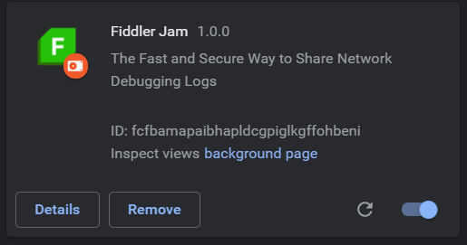

# Error Handling

Submitting a Fiddler Jam log is an operation that requires access to specific API endpoints and specific access levels for the user that accesses the Internet through the browser. Some users might experience an issue while starting the extension, capturing traffic, or submitting a generated Fiddler Jam log. In case you are facing a similar scenario, follow the following steps:

- Verify that you have active Internet access
- Verify that you have access to the following test endpoint: 

    [https://fiddler-backend-production.s3.amazonaws.com/connectivity-test/check.html](https://fiddler-backend-production.s3.amazonaws.com/connectivity-test/check.html)

In case the issue resides elsewhere, proceed with collecting the error data from your browser.

- Open [chrome://extensions/?id=fnkjlegmkbicdodlheligomlfbdblpf](chrome://extensions/?id=fnkjlegmkbicdodlheligomlfbdblpf). When the Fiddler Jam extension is installed the link will open the Fiddler Jam extension details page. Scroll down and enable the **Collect errors** toggle.
- Record and submit a test session, then open **chrome://extensions/** and send us a screenshot of the errors

   
- If no errors are shown in the **chrome://extensions/** screen, open the **background page** (from the **Manage extensions** page). A Chrome DevTools console opens in another window. Go to the **Console** tab and again click the **Start capture** button. Log all errors that appear in the Chrome DevTools console in an external file.

   
- Send the error logs and the screenshot to the [Fiddler Jam support team]().
