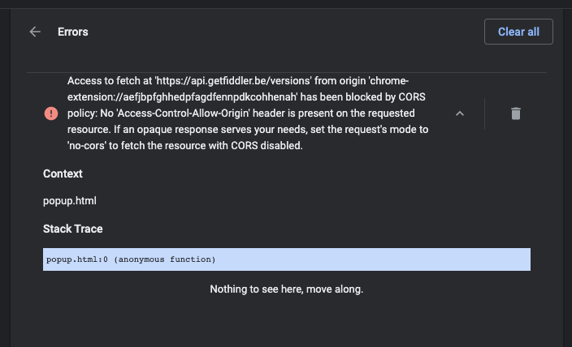

# Error Handling

Submitting a Fiddler Jam log requires access to specific API endpoints and to specific access levels for the users who use the Internet through the browser.

Some end users might experience an issue while starting the extension, capturing traffic, or submitting a generated Fiddler Jam log.

To handle such possible errors, follow the suggested steps:

1. Verify that you have an active Internet connection.

1. Verify that you have access to the following test endpoint:

    [https://fiddler-backend-production.s3.amazonaws.com/connectivity-test/check.html](https://fiddler-backend-production.s3.amazonaws.com/connectivity-test/check.html)

If the issue resides elsewhere, proceed with collecting the error data from your browser:

1. Open [chrome://extensions/?id=fnkjlegmkbicdodlheligomlfbdblpf](chrome://extensions/?id=fnkjlegmkbicdodlheligomlfbdblpf). When the Fiddler Jam Chrome Extension is installed, the link will open the Chrome Extension **Details** page. Scroll down and enable the **Collect errors** toggle.

1. Record and submit a test session. Then, open `chrome://extensions/` and send a screenshot of the occurred errors to the [Fiddler Jam support team]().

   

1. If no errors are listed in the `chrome://extensions/` screen, go to the **Manage extensions** page and open the **Background** page. A Chrome DevTools console opens in another window.

1. Go to the **Console** tab and click the **Start capture** button. Log all errors that appear in the Chrome DevTools console in an external file.

   

1. Send the error logs and the screenshot to the [Fiddler Jam support team]().
