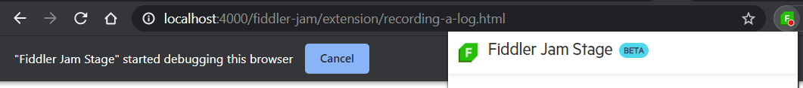

# First Steps with Fiddler Jam Chrome Extension

This tutorial describes how to install and start using the Fiddler Jam Chrome Extension.

- First, you will install the lightweight Fiddler Jam Chrome Extension.
- Next, you'll record a network request and then save it.
- Finally, you will share the issue through the link, which will be automatically generated when you upload the log to the Fiddler Jam Portal cloud space.  

The following video demonstrates the basic steps from this guide by showing how to [install the Fiddler Jam Chrome Extension](https://chrome.google.com/webstore/detail/fiddler-jam/fnkjlegmkbicdodlheligomlfbdblpfj) from the Google Chrome Web Store.

## Prerequisites

* Install the Chrome browser on your machine.
* Provide an active Internet connection with access to the following URLs:
```curl
  https://*.getfiddler.com/
  https://*.amazonaws.com/
```

## Installing the Extension

You'll first have to add the Fiddler Jam Chrome Extension. Before you start, make sure you are not browsing as a guest nor you're in the Incognito mode.

1. Open the Google Chrome browser on your computer.
1. Open the [**Chrome Web Store** page for Fiddler Jam](https://chrome.google.com/webstore/detail/fiddler-jam/fnkjlegmkbicdodlheligomlfbdblpfj).
1. Click **Add to Chrome**.
1. In the confirmation popup, click **Add extension**.

## Pinning the Extension

For quicker and easier access, now pin the Extension:

1. Click the **Extensions** button on the Google Chrome toolbar next to your profile avatar.
1. Click the pin next to the **Fiddler Jam** extension.
1. In the **Welcome** screen prompt, follow the [Terms of Service](https://www.telerik.com/purchase/license-agreement/fiddler-jam-beta) and the [Privacy Policy](https://www.progress.com/legal/privacy-policy) information and read and accept them.

After successfully installing the Extension and if you prefer, you can change the site access and enable the Extension to work in the Incognito mode.

## Recording a Log

In this step you'll record a captured traffic session so that you can isolate a network issue and then be able to share it with the engineering teams for further analysis.  

1. Launch Fiddler Jam by clicking the  extension icon.

    If you expand [**Advanced Options**](), you'll see that some of the settings are enabled or disabled by default. For the purposes of this guide, let's not change any of them and work with the default ones.

1. Click **Start Capture** to start recording.

    

    As a result, Fiddler Jam initiates the recording of all network activity in the current browser tab, and a notification appears informing you that Fiddler Jam has started debugging. Close the notification or click **Cancel** safely as these won't stop the capturing. Hide the Fiddler Jam window by clicking anywhere in the browser tab, and continue recording. Try not to exceed the maximum size of a recorded of 50MB.

    

1. When the issue has been captured, click **Stop Capture** to end the recording.
1. Let's now preview the recorded log&mdash;click the **Capture Successful** line. The **Capture Details** screen will load and display the captured session.

   

1. After previewing the record, go back to the previous screen.

## Submitting the Log

At this point, the captured traffic is recorded as a log but is not yet submitted and saved in the Fiddler Jam Portal cloud space. Now let's use the generated link to share the issue with the engineering teams for troubleshooting and analysis.

1. Go to [**Sharing options**]() and set the access level for the recorded log.

    Here you have an option to make the log public or to share it with specific people, an also you can protect the log with a password. However, for demonstration purposes, let's make the log public and not use a password.

1. Create the public link by selecting **Share with link** and clicking **Get Link**. The generated link points to the Fiddler Jam Portal cloud space, which contains the submitted log. This URL is accessible only for Fiddler Jam Portal users.

    Similar to the previous step options, here you have the **Share with specific people** option, which will create a link only for the Fiddler Portal users who are explicitly added to the Portal with their account emails. Again, for the purposes of this guide, ignore that option now as you'll submit a public link.  

    

1. Click **Copy Link** to store the unique URL to the clipboard and paste this link to share the recorded logs with the Fiddler Jam Portal users.

    All submitted logs are private and are accessible for Fiddler Jam Portal users with the proper access rights only.

   

That was it! Now you are ready to dive more deeply into Fiddler Jam Chrome Extension and take full advantage of its slick functionalities!

## Next Steps

* [Managing the Chrome Browser Settings during Installation]()
* [Advanced Capturing Options]()
* [Link Sharing Options]()
* [Error Handling]()
