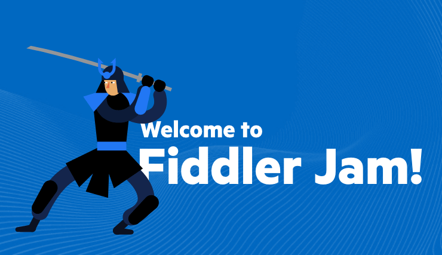

# Welcome to Fiddler Jam

**Fiddler Jam** is a troubleshooting solution for support and development teams designed to help them troubleshoot issues quickly, easily, and securely. How does it work? Customers share network logs via a Chrome extension instead of manually attaching them to an email or a support ticket. The support team analyzes the logs for troubleshooting in a safe cloud space. Developers debug further by inspecting the logs in the [Fiddler Jam portal](https://jam.getfiddler.com) or with the help of the Fiddler Everywhere application.

**HTTP(S) Traffic Inspection & Analysis**

The Fiddler Jam Chrome extension logs all HTTP(S) traffic between your Chrome browser and the Internet.

**Screenshots on User Interactions**

The extended log information includes screenshots for each user interaction with the page (clicks) during the HTTP(S) traffic recording. Empower your recording with visual information related to specific reproduction workflows.

**Record Developer Logs**

Record the developer's console logs for additional debug information and for investigation of complex issues on-the-fly.

**Cloud Space Submissions**

Recorded logs can be easily submitted to the Fiddler Jam portal, where they can be saved, organized, analyzed, and shared with other collaborators. The Fiddler Jam cloud portal provides means to control accessibility by providing access rights.

**Fiddler Everywhere Integration**

Submitted logs are compatible with Fiddler Everywhere for in-depth investigation.

## Chrome Extension Getting Started

Enable and configure the Fiddler Jam extension by following [the installation steps]().

If you are familiar with how a Chrome extension works, you could skip the above tutorial and directly install the [Chrome extension](https://chrome.google.com/webstore/detail/fiddler-jam/fnkjlegmkbicdodlheligomlfbdblpfj) from the Google Chrome Web Store.

## Fiddler Jam Portal

[The Fiddler Jam portal]() is a cloud space that allows you to safely store, organize and analyze submitted logs coming from your customers. Some of the portal's key features include:

- User roles with different access rights.

- Safe online storage.

- One-click integration with Fiddler Everywhere.

## Documentation

[Official Fiddler Jam documentation](https://docs.telerik.com/fiddler-jam/introduction)

We believe documentation is best when the content is a product of the collaboration between the builders and consumers of that product. Everybody can play a role in making our documentation better, and we encourage you to help us with that task in the way that you choose:

- Send Feedback

    Use the __Was this article helpful?__ functionality to give us feedback and ideas on improving the documentation. Alternatively, you could request a feature or report a bug using the [Fiddler Everywhere Feedback Portal](https://feedback.telerik.com/fiddler-everywhere).

- Create an Issue

    If you find an issue with our docs that needs addressing, the best way to let us know is by creating an issue in our [Github repository](https://github.com/telerik/fiddler-jam-docs). When creating an issue, please provide a descriptive title, be as specific as possible, and link it to the documentation article. If you can provide a link to the closest anchor to the issue, that is even better.

- Send a Pull Request

    Creating an issue is excellent, but what we love are pull requests. If you find a problem in the docs or even feel like creating new content, we’d be happy to have your contributions! 

    To do this, you must fork our documentation and submit a pull request. That way, you may contribute an update exactly where you found the error. After that, our technical writing team will need to approve your change request. Please use only standard markdown. For more detailed instructions, please follow the [contribution instructions](https://github.com/telerik/fiddler-jam-docs#contributing) published in GitHub. You could directly initiate a pull request by using the __Improve this article__ functionality.

## License

Licensing agreement and detailed information about the different licenses you should acquire are available in the [Licensing](https://www.telerik.com/purchase/license-agreement/fiddler-everywhere) section.

