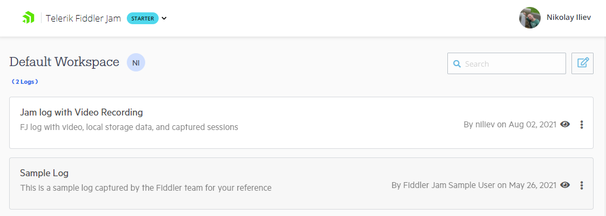
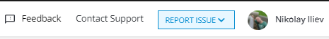
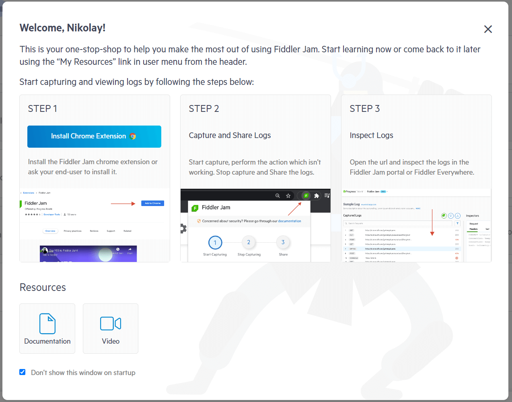

# Fiddler Jam Portal

The [Fiddler Jam portal](https://jam.getfiddler.com) is the cloud space where logs submitted from you or other users can be viewed, organized, and analyzed. The Fiddler Jam portal is accessible only for users with active [Fiddler Jam portal subscriptions](#subscriptions). The Fiddler Jam portal provides various means to organize, access, and work with submitted logs. The portal allows [account owners](#portal-users) to set up different roles for the portal users with different access rights.

An active Internet connection with access to the URLs listed below is required to access the Fiddler Jam portal.

```
https://*.getfiddler.com/
https://*.amazonaws.com/
```

>tip You can use [our connectivity check link](https://fiddler-backend-production.s3.amazonaws.com/connectivity-test/check.html) to test your ability to access the required Fiddler endpoints.

When you open the Fiddler Jam portal for the first time, it loads a sample log as a reference.. You can [add new logs by opening a log link](#open-submitted-logs), [inspect log details](#working-with-logs), organize submitted logs into [workspaces](), [open logs in Fiddler Everywhere for deep-dive debugging](), and share logs with Fiddler Jam collaborators.




## Portal Users

The Fiddler Jam login accepts using custom credentials or Google authentication, but the portal will be accessible only for usernames/emails that are part of an active subscription. Depending on the user assigned role, the Fiddler Jam portal will provide a different level of accessibility and features as follows:

- Unregistered users won't be able to open the Fiddler Jam portal or load generated Fiddler Jam links. Note that no registration is needed to use the Fiddler Jam Chrome extension.
- Fiddler Jam portal seats with the **viewer** role can see only logs [added to a workspace](#add-submitted-log-to-workspace). If a viewer opens a public link, a page will inform the user that the links need to be added to the account workspace.
- Fiddler Jam portal seats with the **user** role can open public logs, create and manage workspaces, manage existing logs (manage, add and remove from workspaces).

Learn more about :
- [The Fiddler Jam **extension users**](#extension-users)
- [The Fiddler Jam portal seats with **Viewer** role](#viewer-role)
- [The Fiddler Jam portal seats with **User** role](#user-role)


## Using Submitted Logs

The Fiddler Jam portal allows organizing, accessing, and reusing the logs submitted from the Fiddler Jam extension. Logs can be added to workspaces, edited, shared, downloaded, or opened directly in [Fiddler Everywhere](https://docs.telerik.com/fiddler-everywhere/introduction) for in-depth analysis.

Learn more about:
- [The portal workspaces]()
- [Working with submitted logs]()
- [The Fiddler Everywhere integration]()


## Portal Menu

The Fiddler Jam portal menu is accessible from the top-right corner from the account icon. The menu consists of **Settings**, **My Resources**, and **Sign Out** options.



### Settings

#### Privacy

Your information and usage statistics help us understand product usage better and continue building the product you love. To subscribe/unsubscribe from participating in the usage statistics sharing:

1. Open __Settings > Privacy__ menu (accessible from the top-right corner from the account icon).
2. Check/uncheck the __Automatically send data to help us improve the product__ option depending on whether you want to send usage statistics.
3. Click on __Save__ to apply the change.

### My Resources

The **My Resources** option will popup a window that contains basic Fiddler Jam usage instructions and fast resource links to the Fiddler Jam documentation site and YouTube videos. This layout automatically appears the first time the user loads the Fiddler Jam portal page.



### Sign Out

Use the **Sign Out** option to log out the currently active user.


## Subscriptions

Fiddler Jam portal provides various subscription plans to accommodate the different user needs. Visit [https://www.telerik.com/fiddler-jam](https://www.telerik.com/fiddler-jam) for more information about the subscription plans.


## Trial Plan

Activate the trial plan through the [Fiddler dashboard](https://dashboard.getfiddler.com) to test the Fiddler Jam portal for 14 days. The trial period applies the quotas for the Business plan.

## Trial Version and Commercial License

Fiddler Everywhere offers a 30-day trial with a full-featured version of the tool&mdash;no restrictions! What’s more, you are eligible for complete technical support during your trial period in case you have any questions. To sign up for a free 30 day trial, go [here](https://www.telerik.com/download/fiddler-everywhere). In addition, [the Fiddler Everywhere dashboard panel]() provides information and options for managing your subscription plans.

To use Fiddler Everywhere commercially, you need to purchase a license. The terms of use are fully described in the [Fiddler Everywhere License Agreement](https://www.telerik.com/purchase/license-agreement/fiddler-everywhere).

* For more information about the available subscription plans, go to the [Fiddler Everywhere purchase page](https://www.telerik.com/purchase/fiddler).
* For more information on the available commercial and free support channels, refer to the article on the [available Fiddler Everywhere support options]().
