# Third-party Integrations

All Jam logs added to a portal workspace can be linked to third-party tracking solutions. Currently, the Jam portal supports integrations with the following services:

- [GitHub](https://github.com/) issues.

- [Jira](https://www.atlassian.com/software/jira) projects.

- [Trello](https://trello.com/en) boards.

Note that you can link only logs that are part of portal **workspace**.

## Linking a Log to GitHub Issues

### Link to New GitHub Issue

To link a Jam log to a new GitHub issue:

- Use the integration button from the main log menu (top-right corner) to link a log to a selected third-party tracking solution. 

    _Integration options from the main log menu_
    
    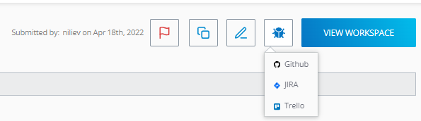

- Select and press the **GitHub** option. You might be asked for authorization (for the initial time GitHub integrations is used).

- Choose **Create Issue** tab to create an entirely new GitHub issue.

    * Select the GitHub project where the issue will reside.
    * Add a summary (corresponds to GitHub issue title)
    * Add a description (corresponds to GitHub issue comment). The description contains a quick link to the Fiddler Jam log by default.

    _Create new GitHub issue_

    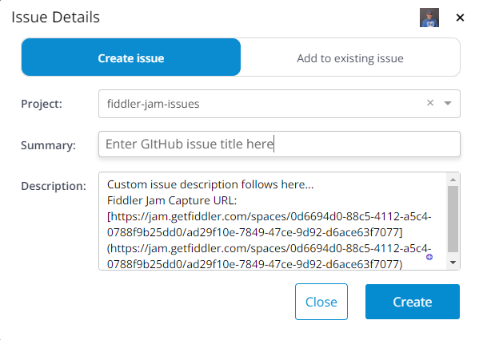

- Click the **Create** button to finalize the GitHub issue creation. 

The newly created GitHub issue is immediately accessible.

_example for newly created GitHub issue_

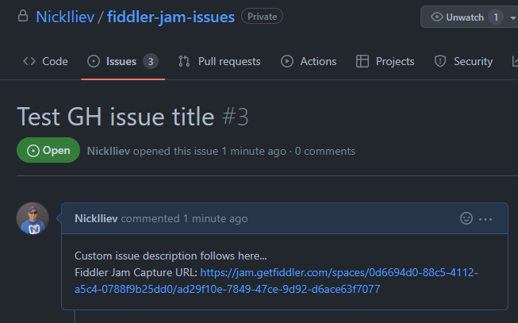

### Add to Existing GitHub Issue

To add a Jam log and comment to an existing GitHub issue:

- Use the integration button from the main log menu (top-right corner) to link a log to a selected third-party tracking solution. 

    _Integration options from the main log menu_

    

- Select and press the **GitHub** option. You might be asked for authorization (for the initial time GitHub integration is used)

- Choose **Add to Existing Issue** tab to add a comment to an already existing GitHub issue.

    * Select the GitHub project where the issue resides.
    * Select a GitHub issue from the drop-down.
    * Add a comment (corresponds to a new GitHub issue comment). The comment contains a quick link to the Fiddler Jam log by default.

    _Add to Existing Issue option_

    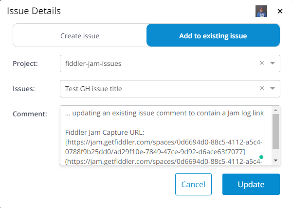

- Click the **Update** button to add the new comment to the existing GitHub issue. 

The updated GitHub issue is immediately accessible.

_example for updated GitHub issue_

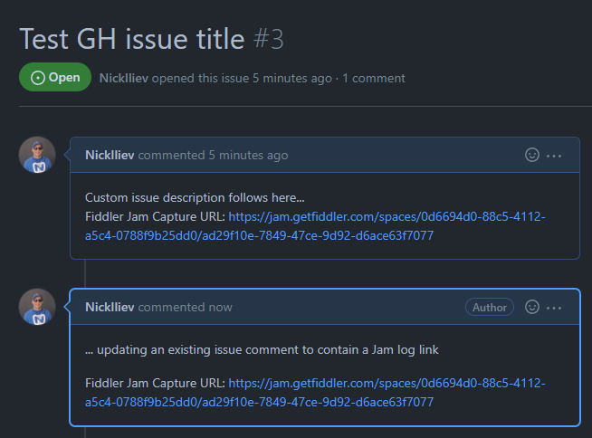

### Linked Log GitHub Options

A portal log can be linked only to a single tracking system. Once a log is linked, use the integration button from the main log menu (top-right corner) for a quick link to the GitHub issue (through the **Open in GitHub** option) or to unlink the log (through the **Unlink log from GitHub** option). Note that unlinking a log won't change the GitHub issue.

_Linked Log options_

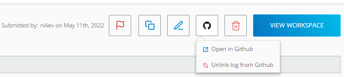

### Link to New Jira Issue

To link a Jam log to a new Jira issue:

- Use the integration button from the main log menu (top-right corner) to link a log to the selected third-party tracking solution. 

    _Integration options from the main log menu_

    

- Select and press the **JIRA** option. You might be asked for authorization (for the initial time when the Jira integrations is used).

- Choose **Create Issue** tab to create an entirely new Jira issue.

    * Select the Jira project where the issue will reside.
    * Select the Jira issue type from the drop-down menu (select **Task**, **Bug**, **Story**, or other project issue types).
    * Add a summary (corresponds to Jira issue title)
    * Add a description (corresponds to Jira issue description). The description contains a quick link to the Fiddler Jam log by default.

    _Create new Jira issue_

    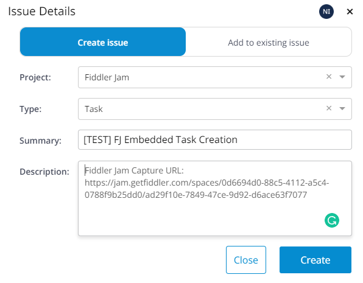

- Click the **Create** button to finalize the Jira issue creation. 

The newly created Jira issue is immediately accessible.

_Excample for newly created Jira issue_

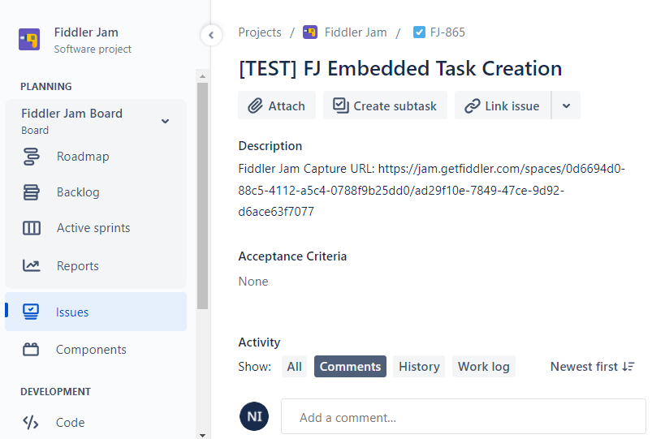

### Add to Existing Jira Issue

To add a Jam log and comment to an existing Jira issue:

- Use the integration button from the main log menu (top-right corner) to link a log to the selected third-party tracking solution. 

    _Integration options from the main log menu_

    

- Select and press the **JIRA** option. You might be asked for authorization (for the initial time Jira integration is used)

- Choose **Add to Existing Issue** tab to add a comment to an already existing Jira issue.

    * Select the Jira project where the issue resides.
    * Select a Jira issue from the drop-down.
    * Add a comment (corresponds to a new Jira issue comment). The comment contains a quick link to the Fiddler Jam log by default.

    _Add to Existing Issue_

    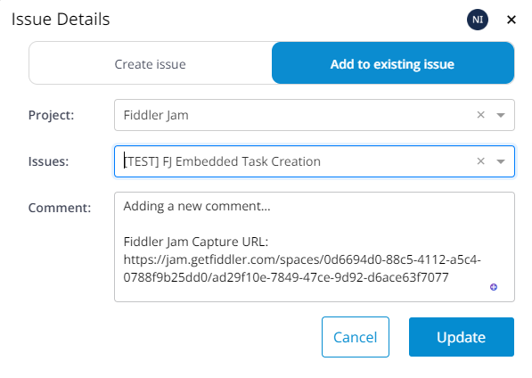

- Click the **Update** button to add the new comment to the existing Jira issue. 

The updated Jira issue is immediately accessible.

_Example for updated Jira issue_

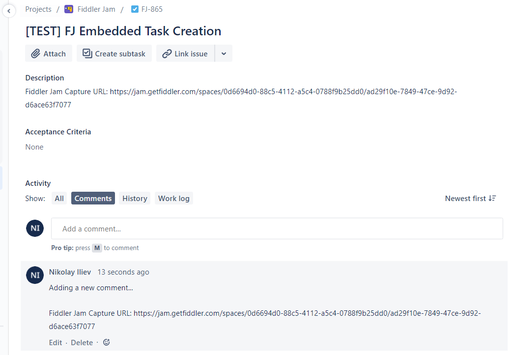

### Linked Log Jira Options

A portal log can be linked only to a single tracking system. Once a log is linked, use the integration button from the main log menu (top-right corner) for a quick link to the Jira issue (through the **Open in Jira** option) or to unlink the log (through the **Unlink log from Jira** option). Note that unlinking a log won't change the existing Jira issue.

_Linked Log options_

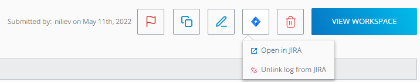

## Linking a Log to Trello

### Link to New Trello task

To link a Jam log to a new Trello task:

- Use the integration button from the main log menu (top-right corner) to link a log to the selected third-party tracking solution. 

    _Integration options from the main log menu_

    

- Select and press the **Trello** option. You might be asked for authorization (for the initial time when the Trello integration is used).

- Choose **Create Issue** tab to create an entirely new Trello task.

    * Select the project (corresponds to Trello board) where the task will reside.
    * Select the Trello list type from the drop-down menu (for example, **ToDo**, **Doing**, **Done**, or other board list types).
    * Add a summary (corresponds to Trello task title)
    * Add a description (corresponds to Trello task description). The description contains a quick link to the Fiddler Jam log by default.

    _Create new Trello task_

    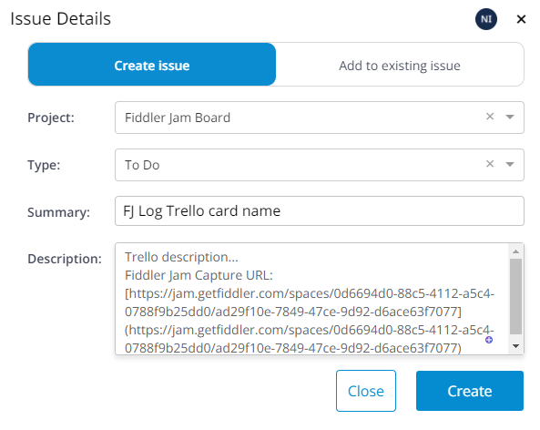

- Click the **Create** button to finalize the Trello task creation. 

The newly created Trello issue is immediately accessible.

_Example for created Trello task_

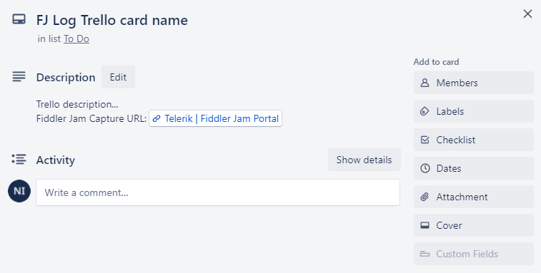

### Add to Existing Trello Task

To add a Jam log and comment to an existing Trello task:

- Use the integration button from the main log menu (top-right corner) to link a log to the selected third-party tracking solution. 

    _Integration options from the main log menu_

    

- Select and press the **Trello** option. You might be asked for authorization (for the initial time Trello integration is used)

- Choose **Add to Existing Issue** tab to add a comment to an already existing Trello task.

    * Select the project (corresponds to Trello board) where the task resides.
    * Select the existing Trello task from the drop-down.
    * Add a comment (corresponds to a new Trello task comment). The comment contains a quick link to the Fiddler Jam log by default.

    _Add to Existing Issue_

    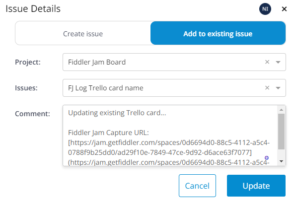

- Click the **Update** button to add the new comment to the existing Trello task. 

The updated Trello task is immediately accessible.

_Updated Trello task result_

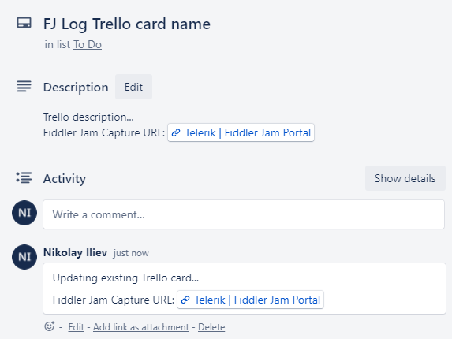

### Linked Log Trello Options

A portal log can be linked only to a single tracking system. Once a log is linked, use the integration button from the main log menu (top-right corner) for a quick link to the Trello task (through the **Open in Trello** option) or to unlink the log (through the **Unlink log from Trello** option). Note that unlinking a log won't change the existing Trello task.

_Linked Log options_

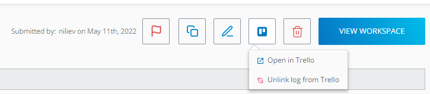

## Signing Out 

Once an integration service is authorized, Fiddler jam will keep you logged in. You can explicitly sign our from selected service through the **Integration** section in the user's settings menu (the user icon on the top-right corner of the Fiddler Jam portal).

_Integrations settings_

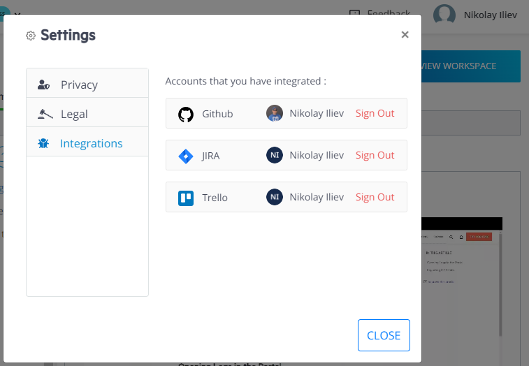