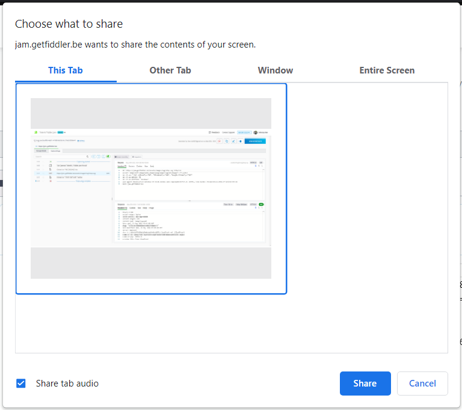
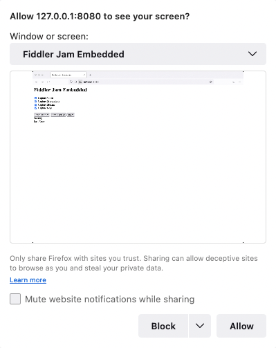

# Fiddler Jam Embedded

Fiddler Jam Embedded is a JavaScript library that provides an API to integrate the capture and share functionalities into your page while using your UI. 

## Integrate Fiddler Jam into Your App

Follow the steps below to include and use Fiddler Jam Embedded library in your webpage:

1. Provide the list of domains that will integrate it (you can use Fiddler Jam Embedded only with a pre-set list of domains)

    ```CSV
    getfiddler.com, telerik.com, *.example.com
    ```

1. Obtain and store your unique Fiddler Jam Embedded API key.

1. Import the Fiddler Jam API script into your HTML page from the following CDN link: https://downloads.getfiddler.com/jam-embedded/fiddler-jam-embedded.js.

1. Initialize the Fiddler Jam Embedded object with your Fiddler Jam API key. The Fiddler Jam Embedded object is attached to the [`window`](https://www.w3schools.com/jsref/obj_window.asp) object of the page as a property called `_fiddlerJamEmbedded`.

    ```JavaScript
    <html lang="en">
        <head>
            <meta charset='utf-8'>
            <meta name='viewport' content='width=device-width,initial-scale=1'>
        
            <title>Fiddler Jam Embedded</title>
            <script src="https://downloads.getfiddler.com/jam-embedded/fiddler-jam-embedded.js"></script>
            <script>
                const jam = window._fiddlerJamEmbedded;
                jam.init({
                    apiKey: '<your-unique-Fiddler-Jam-API-key-here>'
                });
                // .. custom implementation follows here
            </script>
        </head>
    </html>        
    ```

    >important The Fiddler Jam API key is unique per organization and grants access to your workspaces.

1. Create a `service-worker.js` file and import the service worker script from the following CDN link: https://downloads.getfiddler.com/jam-embedded/fje-service-worker.js.

    By default, the `service-worker.js` file is expected to be on the same level as the HTML page that contains the `fiddler-jam-embedded.js` CDN script. You can change the default path of the worker file through the `InitOptions` object and its `serviceWorkerPath` property. Below you can find an example for importing the service worker from the Fiddler CDN.
    
    ```JavaScript
    self.importScripts(`https://downloads.getfiddler.com/jam-embedded/fje-service-worker.js`);
    ```

## Fiddler Jam API

The Fiddler Jam Embedded object (`_fiddlerJamEmbedded`) is attached to [the `window` DOM object](https://www.w3schools.com/jsref/obj_window.asp). 

### Properties

The Fiddler Jam Embedded object provides the following properties:


| Property Name       | Type               | Description                 |
| ---------------     | ------------       | ------------                |
| `state`             | `CaptureState`       | Indicates the current process state (enumeration with the following string values : `"ready"`, `"initialized"`, `"starting"`, `"started"`, `"sharing"`, `"shared"`).    |
| `options`           | `StartOptions`       | An object used during the Fiddler Jam Embedded startup. Indicates which capturing options will be turned on. The default values are `captureScreenshots = true`, `captureConsole = true`, `captureStorage = true`, `captureVideo = true`, `openNewTab = true`, `reloadPage = false`.                          |


### Methods

The Fiddler Jam Embedded object provides the following methods:

| Method Name       |   Accepted Arguments   | Description    |
| ---------------     |  ---------- | ------------  | -----------                                       |
| `init(options: InitOptions)`| `InitOptions` is an object of type `{ apiKey: string, serviceWorkerPath:string }` | Initialize the Fiddler Jam Embedded process with an unique API key through the `apiKey` argument. The `serviceWorkerPath` is not a mandatory argument and if omitted will default to `./service-worker.js`. |
| `start(options: StartOptions)` |  `StartOptions` is an object of type `{ captureVideo: boolean, captureScreenshots: boolean, captureStorage: boolean, captureConsole: boolean, maskSensitiveData: boolean, reloadPage: boolean }` | An asynchronous method that starts the capturing with the explicitly activated start options. |
| `startVideoCapturing()` |  n/a |  An asynchronous method that starts the video recording on non-Chromium browsers like Firefox and Safari. |
| `stop()` | n/a | An asynchronous method that stops the capturing and sets the state property to `"stopped"`. |
| `share(options: ShareOptions)` |  `ShareOptions` is an object of type `{ description:string, workspaceId:string, submittedBy:string }` | An asynchronous method that returns a string with the generated Fiddler Jam Log share URL. The `ShareOptions` argument is optional and if omitted, the log will be automatically uploaded to the default organizational workspace. |
| `reset()` |  n/a | Stops and completely resets the capturing, its state, and its properties. |
| `addErrorEventListener(handler)` |  `ErrorEventHandler` of type `(error => void)` | An event listener to detect errors during the capturing processes. |
| `addStateChangedEventListener(handler)` |  `StateChangedEventHandler` of type `(state) => void)` | An event listener to detect changes in the `state` property of the Fiddler Jam Embedded object. |


### ShareOptions Specifics

The `share` method accepts an optional argument of the `ShareOptions` object type:

```JavaScript
let shareOptions = {
    description: "...your custom description of the share case",
    workspaceId: "<the-unique-workspace-id>",
    submittedBy: "niliev-page-admin"
};
```

To obtain the `<the-unique-workspace-id>`, open https://jam.getfiddler.com/ and navigate to the desired workspace. Then, extract the workspace ID from the browser address bar by copying the last API endpoint. For example, the following URL https://jam.getfiddler.com/spaces/0d6694d0-88c5-4112-a5c4-0788f9b25dd0 loads a workspace with ID `0d6694d0-88c5-4112-a5c4-0788f9b25dd0`. 

Alternatively, you can use the `share` method without the optional `ShareOptions` argument. In that case, the log will be uploaded to the default organizational workspace.


## Basic Implementations

The following code snippets demonstrate a basic Fiddler Jam Embedded implementation that you can run through a test localhost server.

If no file path is provided through the `serviceWorkerPath` argument, then the `service-worker.js` file must be on the same level as the `index.html` file below.

```JavaScript
self.importScripts(`https://downloads.getfiddler.com/jam-embedded/fiddler-jam-embedded.js`);
```

The following snippet creates a basic HTML page that utilizes most of the Fiddler Jam Embedded functionalities. Different browsers, like Edge, Chrome, Brave, and other non-Chromium browsers such as Firefox and Safari, may show behavioral differences.

>tip One of the crucial differences is the user interaction needed to record a video in Chromium browsers vs. non-Chromium browsers when the page is reloaded. 
> 
> With Chromium browsers, you can call the `start()` method, and if the `captureVideo` option is set to `true`, the video recording will start immediately after the page is reloaded (`reloadPage` set to `true`). 
> 
> However, browsers like Firefox and Safari require user interaction to re-confirm the start of any video recording. This is where developers can use the `startVideoCapturing` method to explicitly provide the needed user interaction once the page is reloaded. The following snippet demonstrates how to achieve the desired behavior through the button with the `btn-start-video` id.

The snippet uses a sample `index.html` page. Note that you will have to replace `<your-unique-fiddler-jam-api-key-here>` with your actual Fiddler Jam Embedded API key.

```HTML
<html lang="en">
    <head>
        <meta charset='utf-8'>
        <meta name='viewport' content='width=device-width,initial-scale=1'>
    
        <title>Fiddler Jam Embedded</title>

        <script src="https://downloads.getfiddler.com/jam-embedded/fiddler-jam-embedded.js"></script>
        <script>
            // The Fiddler Jam Embedded object attached to the DOM window object through _fiddlerJamEmbedded.
            const jam = window._fiddlerJamEmbedded;

            // Use the error event listener to catch possible issues.
            // For example: Firefox and Safari users needs to explicitly allow video recording through user interaction.
            // The error listener is used to load custom UI that calls the startVideo() method.
            jam.addErrorEventListener(e => {
                document.getElementById('last-error').innerHTML = e;
                if (e.name === 'CaptureDisplayError') {
                    document.getElementById('capture-info').innerHTML = 'Started without video. You need to start video recording manually.';
                    document.getElementById('btn-start-video').hidden = false;
                }
            });

            // Initialization of the Jam Embedded process. 
            // Additionally, the serviceWorkerPath can be passed with an alternative worker path.
            jam.init({
                apiKey: '<YOUR API KEY>'
            });

            let captureInfo = '';

            // Setting the default capture options
            // used as argument in the start method.
            let captureOptions = {
                captureVideo: true,
                captureScreenshots: true,
                captureStorage: true,
                captureConsole: true,
                reloadPage: false
            };

            function getCaptureInfo(jamState) {
                switch (jamState) {
                    case 'ready':
                    case 'initialized':
                        return 'Ready to capture..';
                    case 'starting':
                        return 'Starting..';
                    case 'started':
                        return 'Started..';
                    case 'stopped':
                        return 'Stopped..';
                    case 'sharing':
                        return 'Sharing..';
                    case 'shared':
                        return 'Sharing complete! Jam Session Url copied to clipboard.';
                    default:
                        return '';
                }
            }

            function updateCaptureInfo() {
                captureInfo = getCaptureInfo(jam.state);
                document.getElementById('capture-info').innerHTML = captureInfo;

                if (jam.options) {
                    captureOptions = jam.options;
                }

                document.getElementById('captureVideo').checked = captureOptions.captureVideo;
                document.getElementById('captureScreenshots').checked = captureOptions.captureScreenshots;
                document.getElementById('captureStorage').checked = captureOptions.captureStorage;
                document.getElementById('captureLogs').checked = captureOptions.captureConsole;
            }

            function initSettingsEvents() {
                document.getElementById('captureVideo').addEventListener('change', (e) => {
                    captureOptions.captureVideo = e.target.checked;
                });

                document.getElementById('captureScreenshots').addEventListener('change', (e) => {
                    captureOptions.captureScreenshots = e.target.checked;
                });

                document.getElementById('captureStorage').addEventListener('change', (e) => {
                    captureOptions.captureStorage = e.target.checked;
                });

                document.getElementById('captureLogs').addEventListener('change', (e) => {
                    captureOptions.captureConsole = e.target.checked;
                });
            }

            window.addEventListener('load', () => {
                updateCaptureInfo();

                jam.addStateChangedEventListener(newState => {
                    updateCaptureInfo();
                });

                initSettingsEvents();
            });

            // Start capture (async method)
            async function start() {
                await jam.start(captureOptions);
            }

            // Start video recording (async method).
            // This method needs to be explicitly called with the user interaction for a non-Chromium browser.
            async function startVideo() {
                await jam.startVideoCapturing();

                document.getElementById('btn-start-video').hidden = true;
                document.getElementById('capture-info').innerHTML = 'Started successfully!';
            }

            // Stop capture (async method).
            async function stop() {
                await jam.stop();
            }

            // Generates and uploads a Fiddler Jam log share URL (async method). 
            // The logs are automatically added to the default organizational workspace in the Fiddler Jam portal.
            async function share() {
                const jamShareUrl = await jam.share();

                document.getElementById('jam-share-url').innerHTML = jamShareUrl;
                
                await navigator.clipboard.writeText(jamShareUrl);
            }
        </script>
    </head>
    
    <body>
        <h1>Fiddler Jam Embedded</h1>
        <div>
            <div>
                <div>
                    <input type="checkbox" id="captureVideo" name="captureVideo" />
                    <label for="captureVideo">Capture Video</label>
                </div>
                <div>
                    <input type="checkbox" id="captureScreenshots" name="captureScreenshots" />
                    <label for="captureScreenshots">Capture Screenshots</label>
                </div>
                <div>
                    <input type="checkbox" id="captureStorage" name="captureStorage" />
                    <label for="captureStorage">Capture Storage</label>
                </div>
                <div>
                    <input type="checkbox" id="captureLogs" name="captureLogs" />
                    <label for="captureLogs">Capture Logs</label>
                </div>
            </div>

            <br />
            
            <div>
                <button id="btn-start" onclick="start()">Start Capture</button>
                <button id="btn-start-video" onclick="startVideo()" hidden>Start Video</button>
                <button id="btn-stop" onclick="stop()">Stop Capture</button>
                <button id="btn-share" onclick="share()">Share</button>
            </div>

            <div id="capture-info"></div>
            <div id="jam-share-url"></div>
            <label>Last Error:</label>
            <div id="last-error"></div>
        </div>
    </body>
</html>

```

## Limitations and Browser Specifics

While incorporating your own Fiddler Jam Embedded tool into your website, note that there are some specifics related to different browsers and the core functionalities.

- To capture a video recording without reloading a page, you can call the `start()` method (through `reloadPage: false` and `captureVideo: true`) on all browsers.

- (For Firefox only) To capture a video recording with reload of a page (through `reloadPage: true` and `captureVideo: true`), you need an explicit user interaction that calls the `startVideoRecording()` once the page is fully reloaded. Chromium browsers are less strict and will allow video recording on a reloaded page without secondary user interaction.

- Video recording is **not** currently supported on Safari (macOS).

- Chromium-based browser (like Chrome, Edge, Brave, Vivaldi, and similar) pops a native window once the `start()` method is called. The window provides multiple recording options to record the current tab, a new tab, a whole OS window, or the entire screen. You have to use the Fiddler Jam reporting within the current browser instance, so it is strongly recommended to always guide your users to select the **This Tab** option.

    

- The Firefox browser pops a native window once the `start()` method is called, where the user is explicitly asked to allow `<your-page-url-here>` to see the selected screen. The window provides multiple recording options (from all active OS windows plus the opportunity to record the entire OS window). You have to use the Fiddler Jam reporting within the current browser instance, so it is strongly recommended to always guide your users to select the **_<your-page-name-here> - Mozzila Firefox_** window.

    

- Browser cookies are not recorded and won't be contained in the generated Fiddler Jam log.

- The network traffic caught by Fiddler Jam Embedded will contain only the default allowlisted CORS headers described here https://developer.mozilla.org/en-US/docs/Glossary/CORS-safelisted_response_header. If you want to capture additional headers, you will need to explicitly modify your server by using the `Access-Control-Expose-Headers` option in your server API and allowlisting the different headers.
