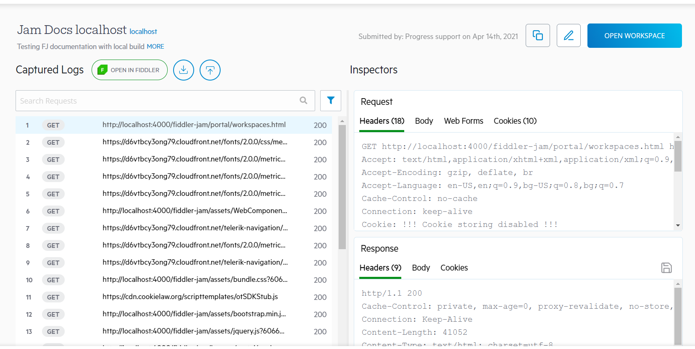
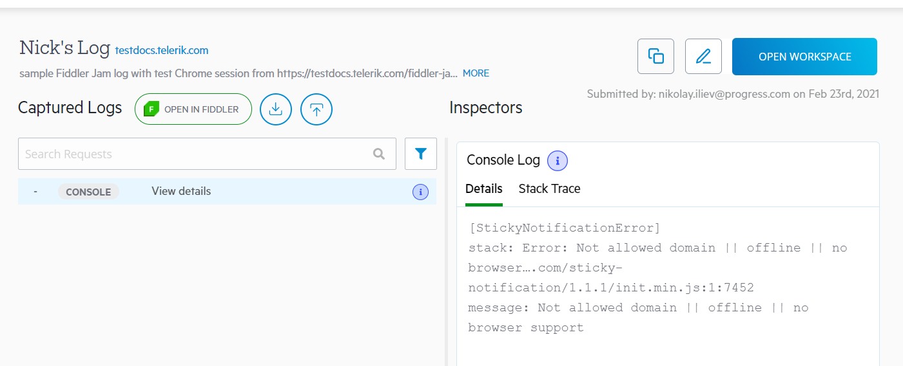

# Working With Submitted Logs

Once [an extension user](#extension-users) submits recorded traffic, the log uploads to the Fiddler Jam cloud space. We store the logs in the cloud storage for 30 days, and then they are deleted. With the Fiddler Jam portal, any [portal user](#user-role) with access rights could save, organize, analyze and work with the provided records. 

## Open Submitted Logs

After a Fiddler Jam user submits a log, the log uploads to the Fiddler Jam cloud space. At this moment, only this user knows the exact address of the log. The next step is for the extension user to share the generated link with other portal users (e.g., a support engineer with Fiddler Jam subscription and user role). The access rules are set via [the link generation options]().

 Fiddler Jam protects the content of any submitted log through the following rules:

1. The submitted log can only be opened by a portal user who meets the access rights requirements set by the extension user via [the link generation options]()).
2. Initially, the submitted log can only be opened by [**a portal user**](#user-role). Quota restrictions apply for the portal user opening the log based on the active subscription (refer to the _Reports per month_ row in [the subscription comparison table](#subscriptions)).
3. (_Optional_) The submitted log can be added to a workspace. Jam logs that are not added to a workspace are automatically deleted after 30 days. 

For [**a portal viewer**](#viewer-role) role to be able to open the submitted log, the log must be added to a workspace (by a portal user), and the extension user should have set an appropriate access level during the link generation.

## Working with Logs

Once a submitted log is opened in the Fiddler Jam portal, there are multiple functionalities that the portal UI provides like:

- [Using the log's details](#log-details) (title, description, etc.).
- [Investigating the log's captured traffic in detail (requests and responses)](#traffic-inspection) - Session data that includes the headers & bodies of each HTTP/HTTPS request and response. 
- [Inspecting the browser events](#browser-events) - Each Jam log contains the browser events triggered during the recording. The events are click, double-click, navigated to, tab opened, tab closed, pressed "Enter or "Tab" keys, scroll events, and text-input (just the event without the actual inputted data).
- [Inspecting the taken screenshots](#screenshot-inspection)- When the extension user explicitly enables the screenshot option, a new screenshot is added for each user interaction that triggers a browser event.
- [Inspecting the recorded video](#video-recording-inspection) - When the extension user explicitly enables the **Capture Video** option, the whole capturing process from start to end is outputted in the **Screen Recording** tab.
- [Analyzing the developer's console logs](#console-log-inspection) - When the extension user enables the **Capture Console** option.
- [Deep dive investigation through Fiddler Everywhere](#fiddler-everywhere-integration).
- [Exporting as HAR file](#export-har).
- [Adding submitted logs to organizational workspaces](#Aadd-submitted-log-to-workspace).

## Jam Log Data

Apart from the [recorded data](#using-logs), each log also contains user-defined [**log details**](#log-details) such as the log title, description, submitted by field, and the workspace. Every Jam log also contains an immutable [**capture info**](#capture-info) that stores technical and environmental data extracted from the extension.

### Log Details

To add or edit the log details of a newly submitted log:

1. Open the submitted log and click on **Add to Workspace**.
1. In the prompted window, edit the log details (_title_, _description_, _submitted by_, _workspace_).
1. Click **Done** when ready. The log is added to the selected workspace with the new details.

To edit the details of a log that is already added in a workspace:

1. Open the submitted log from the workspace.
1. Click on the **Edit Log Details** icon (top-right corner next to _Open Workspace_).
1. Edit the log's _title_, _description_, and _submitted by_ fields.
1. Click on **Done** when ready.

### Capture Info

The **Capture Info** expandable window (to the right of the Jam log title) shows the technical and environmental data extracted from the Jam extension. That includes information about the URL, time, OS, browser, screen resolution, used localization, timestamps, Jam extension version, and the enabled extension [capture options]().

## Logs Inspection

Depending on the selected [capture options](), a Fiddler Jam log can contain:
- [The captured traffic (HTTP/HTTPS sessions)](#traffic-inspection).
- [The Developer's console logs](#console-log-inspection).
- [Screenshots](#screenshot-inspection) (of each user interaction).
- [Video recording](#video-recording-inspection) (of the whole capturing).
- Local/session storage info.

The extension's capture options also allow you to mask sensitive data (like cookies and post-data) and disable the browser cache. Use the different Jam inspectors and tabs to debug and investigate any reported issue in detail.
### Traffic Inspection

Each Fiddler Jam log contains a list of captured HTTP sessions and request/response inspectors. On the left side, called **Captured Logs**, the UI provides the captured HTTP sessions, screenshots, and console logs. On the right side, called **Inspectors**, Fiddler Jam provides the **Request**, and **Response** inspectors (when an HTTP session is selected) or the screenshot/console logs preview screen (when a screenshot or a console log is selected).

To investigate a specific HTTP session:
1. Open the submitted log.
1. (Optional) Filter by search term (while using the Search text field) or Filter by log type (while using the Filter button)
1. Select a session line. 
    - If the selected line is an HTTP session, then the **Request** and **Response** inspectors load the session content (headers, body, cookies, etc.). Note that depending on [the capture options](), some of the submitted information might be masked. 
    - If the selected line is a screenshot, a **Preview** inspector will load the taken screenshot depicting the moment of the user interaction.
    - If the selected line is a console log, a **Console Log** inspector will load the log details and stack trace.

    >tip Each captured HTTP(S) session has a unique line ID that can be used as a reference in both the Fiddler Jam portal and the Fiddler Everywhere desktop application.

>tip The traffic list and the inspectors are inspired by the Fiddler Everywhere UI. Learn more about using [the Request and Response inspectors](https://docs.telerik.com/fiddler-everywhere/user-guide/live-traffic/inspector-types) to investigate the captured traffic.

### Console Log Inspection

If the extension user has explicitly enabled the developer's console logs capturing, a Fiddler Jam log will also contain console log lines.

- Select a console logline in the Captured Logs list - the console log loads in a custom inspector.
- Use the **Details** inspector for examining the console log.
- Use the **Stack Trace** inspector for inspection of the stack trace.

### Screenshot Inspection

Suppose the extension user has explicitly enabled the screenshot capturing. In that case, a Fiddler Jam log will also contain screenshot lines for each user interaction made from the extension user (while the recording is on). 

- Select a screenshot line in the Captured Logs list - the screenshot loads in a screenshot preview inspector.
- Use the **Save** icon to download the screenshot locally as a PNG file.

>tip Fiddler Jam extension will take screenshots on user interactions like following a link, pressing a button, etc.

### Video Recording Inspection

When the extension user explicitly enables the video recording, all of the actions in the browser tabs are output in a video recording.

## Filters

A Fiddler Jam log could contain an excessive number of recorded HTTP requests, browser events (mouse interactions and navigation events), screenshots, console logs, etc.,. Use the search text input to filter out all requests containing the search term within the URL or in the Request Headers. Use the **Filters** (the icon next to the search text input) to filter out the different log entries (requests, screenshots, and console logs).

