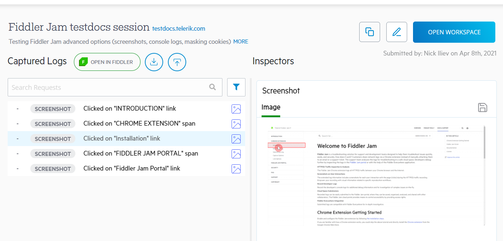

# Submitted JAM Logs

Once [an extension user](#extension-users) submits recorded traffic, the log uploads to the Fiddler Jam cloud space, also known as the [Jam portal](https://jam.getfiddler.com). Any submitted logs are stored in the cloud storage for 30 days, and after that period, if the log is not added to [a workspace](), it will be automatically deleted. With the help of the Fiddler Jam portal, any [portal user](#user-role) with access rights could save, organize, analyze and work with the provided records. 

## Open Submitted Logs

After a Fiddler Jam user submits a log, the log is uploaded to the Fiddler Jam cloud space. At this moment, only this user knows the exact address of the log. The next step is for the extension user to share the generated link with other portal users (e.g., a support engineer with Fiddler Jam portal subscription and user role). The access rules are set via [the link generation options]().

 Fiddler Jam protects the content of any submitted log through the following rules:

- All JAM logs are captured with applied **masking for [any data considered sensitive](#masking-sensitive-data)**.
- The submitted log can be opened only by [a portal user](#user-role) who meets **the access rights requirements set by the extension user** via [the link generation options]()).
- The submitted log can be added to a workspace. Jam logs that are not added to a workspace are **automatically deleted after 30 days**. 

For [**a portal viewer**](#viewer-role) role to be able to open the submitted log, the log must be added to a workspace (by a portal user), and the extension user should have set an appropriate access level during the link generation.

## Working with Logs

Once a submitted log is opened in the Fiddler Jam portal, there are multiple functionalities that the portal UI provides like:

- [Using and editing the log's details](#log-details) (title, description, etc.).
- [Investigating the log's captured traffic in detail (requests and responses)](#traffic-inspection) - Session data that includes the headers & bodies of each HTTP/HTTPS request and response. 
- [Inspecting the browser events](#browser-events) - Each Jam log contains the browser events triggered during the recording. The tracked events are as follows:
     - **click**
     - **double-click**
     - **navigated to**
     - **tab opened**
     - **tab closed**
     - **pressed "Enter"** key
     - **pressed "Tab"** key
     - **scroll** events
     - **text-input** (just the event without the actual inputted data).
- [Inspecting the taken screenshots](#screenshot-inspection)- When the extension user explicitly enables the screenshot option, a new screenshot is added for each user interaction that triggers a browser event.
- [Inspecting the screen recording](#screen-recording) - When the extension user explicitly enables the **Capture Video** option, the whole capturing process from start to end is outputted in the **Screen Recording** tab.
- [Analyzing the developer's console logs](#console-log-inspection) - When the extension user enables the **Capture Console** option.
- [Deep dive investigation through **Fiddler Everywhere**](#fiddler-everywhere-integration).
- [Exporting as **HAR file**](#export-har).
- [Adding submitted logs to **organizational workspaces**](#Aadd-submitted-log-to-workspace).

The extension's capture options also allow you to mask sensitive data (like cookies and post-data) and disable the browser cache. Use the different Jam inspectors and tabs to debug and investigate any reported issue in detail.

## Jam Log Tabs and Inspectors

Each Fiddler Jam log contains a list of entries containing different recorded information (HTTP/HTTPS sessions, console logs, screenshots, browser events, etc.). The log page in the Fiddler Jam portal has the following structure:

1. On the left side, the site provides two main tabs called **Storage Details** and **Captured Logs**.

    - In the **Storage Details**, you will find lists of the entries stored in the Local Storage and in the Session Storage. This tab will contain data only when the extension user explicitly used the **Capture storage info** from the [**Advanced options**]().

    - In the **Captured Logs**, you will find a numerated list of the captured HTTP/HTTPS sessions, screenshots, screen recordings, and console logs. 

1. On the right side, the site provides two tabs called **Screen Recording** and **Inspectors**.

    - In the **Screen Recording**, you will find a screen recording from the browser (taken during the Jam recording). This tab will contain data only when the extension user explicitly used the **Capture video** from the [**Advanced options**]().

    - In the **Inspectors** tab, you will see an inspector that loads the information for the selected line from the **Captured Logs** list. The inspectors are changed depending on whether you are select an HTTP session, console log, browser event, or screenshot. For example, Fiddler Jam loads the **Request** and **Response** inspectors when an HTTP session is selected, the screenshot details screen when a screenshot entry is selected, and then a browser event information inspector when a browser event entry is selected.

### Traffic Inspection

To investigate a specific HTTP/HTTPS session:

1. Open the submitted log.
1. (Optional) Filter by search term (while using the Search text field) or Filter by log type (while using the Filter button)
1. Select a session line from the **Captured Logs** tab. 
    - When the selected line is an HTTP session, then the **Request** and **Response** inspectors load the session content (headers, body, cookies, etc.). Note that depending on [the capture options](), some of the submitted information might be masked. 
    - When the selected line is a user interaction, the inspector will load technical details about the action (for example, the HTML tag, the text value, and the name of the4 specific action).
    - When the selected line is a screenshot of a user interaction, a preview inspector will load the taken screenshot depicting the moment of the user interaction alongside technical data about the action.
    - When the selected line is a console log, a details inspector will load the log details and caputered stack trace.

    >tip Each captured HTTP(S) session has a unique line ID that can be used as a reference in both the Fiddler Jam portal and the Fiddler Everywhere desktop application.

>tip The traffic list and the inspectors are inspired by the Fiddler Everywhere UI. Learn more about using [the Request and Response inspectors](https://docs.telerik.com/fiddler-everywhere/user-guide/live-traffic/inspector-types) to investigate the captured traffic.

### Console Log Inspection

If the extension user has explicitly enabled the developer's console logs capturing, a Fiddler Jam log will also contain console log lines.

- Select a console logline in the Captured Logs list - the console log loads in a custom inspector.
- Use the **Details** inspector for examining the console log.
- Use the **Stack Trace** inspector for inspection of the stack trace.

### Screenshot Inspection

Suppose the extension user has explicitly enabled the screenshot capturing. In that case, a Fiddler Jam log will also contain screenshot lines for each user interaction made from the extension user (while the recording is on). 

- Select a screenshot line in the Captured Logs list - the screenshot loads in a screenshot preview inspector alongside technical data about the action that triggered the screenshot.
- Use the **Save** icon to download the screenshot locally as a PNG file.

>tip Fiddler Jam extension will take screenshots on user interactions like following a link, pressing a button, etc.

### Screen Recording

When the extension user explicitly enables the video recording, the whole recording alongside all of the actions in the browser tabs are output in a video recording. Load the video in the **Screen recording** tab to the right.

### Storage Details

The **Storage Details** tab (to the left) is specialized in displaying the data recorded from the Local Storage and Session Storage.

## Dashboard Log User Interface

### Log Details

Apart from the [recorded data](#log-data), each log also contains user-defined [**log details**](#log-details) such as the log title, description, submitted by field, and the workspace. Every Jam log also contains an immutable [**capture info**](#capture-info) that stores technical and environmental data extracted from the extension.

To add or edit the log details of a newly submitted log:

1. Open the submitted log and click on **Add to Workspace**.
1. In the prompted window, edit the log details (_title_, _description_, _submitted by_, _workspace_).
1. Click **Done** when ready. The log is added to the selected workspace with the new details.

To edit the details of a log that is already added in a workspace:

1. Open the submitted log from the workspace.
1. Click on the **Edit Log Details** icon (top-right corner next to _Open Workspace_).
1. Edit the log's _title_, _description_, and _submitted by_ fields.
1. Click on **Done** when ready.

### Capture Info

The **Capture Info** expandable window (to the right of the Jam log title) shows the technical and environmental data extracted from the Jam extension. That includes information about the URL, time, OS, browser, screen resolution, used localization, timestamps, Jam extension version, and the enabled extension [capture options]().

### Tabs and Inspectors

Each Jam log loads on a screen with different tabs, and each tab has its own conceptual inspectors. Learn more about using the log tabs and inspectors in the [Jam Log Tabs and Inspectors](#jam-log-tabs-and-inspectors) section.

### Search

The **Search** field is available in the **Captured Logs** tab. Use it to filter the captured entries by a search term.

### Filters

A Fiddler Jam log could contain an excessive number of recorded HTTP requests, browser events (mouse interactions and navigation events), screenshots, console logs, etc.  Use the **Filters** (the icon next to the search text input) to filter out the different log entries (requests, screenshots, browser events, and console logs).

### HAR Options

A submitted log can be exported as a HAR file (The HTTP Archive format, or HAR, is a JSON-formatted archive file format for logging of a web browser's interaction with a site) and consequentially used with any 3rd-party software that supports HAR. Use the **Download HAR File** button (the icon to the right of the **FIlters** icon) to download the JAM log as a HAR file.

Any submitted log can also be re-loaded in the Fiddler Jam extension for a mock replay. Use the **Load HAR for mocking** button to load the log in the Fiddler Jam extension.

### Open in Fiddler Everywhere

Any JAM log can be loaded in the standalone Fiddler Everywhere application for further deep-dive investigation. Learn more about Fiddler Everywhere and its cross-platform functionalities from [the official documentation](https://docs.telerik.com/fiddler-everywhere/introduction).

### Copy URL Link

A submitted log can be re-shared via the **Copy URL** button (top-right corner next to the **Submitted by**).

