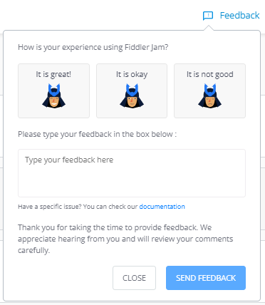
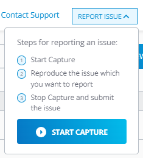
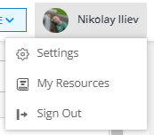
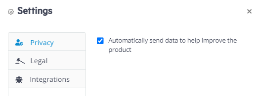
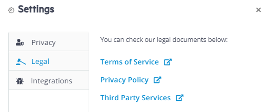

# Fiddler Jam Portal Menu

The Fiddler Jam Portal menu contains the **Feedback**, **Contact Support**, and **Report Issue** options, and the **My Account** section with the **Settings**, **My Resources**, and **Sign Out** options.

The Jam portal menu is located in the top-right corner of the page.

## Feedback

**Feedback** displays options for collecting information from the users regarding the Fiddler Jam Portal experience, such as its features, documentation, etc. Leaving a comment with additional details is optional if your feedback is positive and mandatory if your feedback is neutral or straightforward negative.

## Contact Support

All Fiddler Jam portal users can submit a support ticket through the **Contact Support** option. The support option uses the default email client of the operating system.

## Report Issue

The **Report Issue** functionality allows you to send a detailed Fiddler Jam log with HTTPS capturing, screenshots of the user interactions, and video recording from a selected page within the Fiddler Jam portal. Use this option to report any issues, leave feedback, or suggest improvements related to the Fiddler Jam portal. The core team developers and support engineers review the submitted logs regularly. [Learn more about how to submit an issue here...]()

>tip Behind the scenes, the used technology is called **Fiddler Jam Embedded**, and this option demonstrates how you can integrate Fiddler Jam logs directly into your website. 

## My Account

**My Account** is a menu option available after a successful login. It provides several submenu options like the **Settings**, **My Resources**, and **Sign Out**.

### Settings 

**Settings** contains the **Privacy Settings** options and provides quick links to legal resources.     

#### Privacy Settings

Your information and usage statistics enable the Fiddler team to understand better how Fiddler Jam is used and to continue building an awesome product.

To subscribe or unsubscribe from participating in the sharing of usage statistics:

1. Open **Settings** > **Privacy** (accessible from the account icon in the top-right corner).

1. Check or uncheck the __Automatically send data to help us improve the product__ option depending on whether you want to send usage statistics.

1. Click __Save__ to apply the changes.

#### Legal

The option provides quick links to the following legal documents:

- [Terms of Services (also known as end-user license agreement)](https://www.telerik.com/purchase/license-agreement/fiddler-jam)
- [Privacy Policy](https://www.progress.com/legal/privacy-policy)
- **Third-Party services** opens a list of the third-party services used by Fiddler Jam.

#### Integrations

The option provides quick login links for the [third-party tracking solution systems]().

### My Resources

**My Resources** displays a window containing basic Fiddler Jam usage instructions and fast resource links to the documentation site and the YouTube videos. The layout automatically appears the first time you load the Fiddler Jam Portal page.

### Sign Out

**Sign Out** allows you to log out of the currently logged user and navigate to an introduction page that provides options for creating a new user or using another account.
