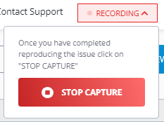
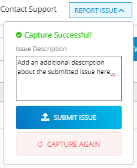

# Report Issue

You can report a portal issue or request support assistance through the **Report Issue** built-in functionality which utilizes the **Fiddler Jam Embedded** technology. The [**Report Issue** button](#report-issue) is part of the [Fiddler Jam Portal menu](). This option allows you to start capturing within the Fiddler Jam portal, record the observed issue, and directly submit the issue to the Fiddler Jam support team. Follow these steps to record and submit your Fiddler Jam portal issue:

1.  Click on **Report Issue** from [Fiddler Jam Portal menu]().

    

1. Click on the **Start Capture** button. The browser screen will refresh, and a native share window appears.

    - On Chromium browsers (like Edge, Chrome, Brave, etc.), select **This Tab** and click on **Share** to start the recording. The triggered recording will contain the HTTP/HTTPS sessions, video recording, console logs, and storage info.
        

    - On non-Chromium browsers (like Firefox, Safari, etc.), the recording will start immediately. The triggered recording will contain the HTTP/HTTPS sessions, console logs, and storage info (no video recording).

1. Reproduce the portal issue by opening the desired Fiddler Jam page and going through the issue steps.    

    >important The **Report Issue** works only with the `*.getfiddler.com` domain. You won't be able to capture traffic from other pages or applications accessing resources outside the Fiddler Jam portal.

1. Click on **Recording** and then click on **Stop Capture** to stop the recording immediately.

    

1. Add as many details as possible in the **Issue Description** field, and click on **Submit Issue**.

    

As a result, the recorded issue will be submitted to the Fiddler Jam support team for further investigation.

>tip The **Fiddler Jam Embedded** is a dedicated API that you can use alongside your unique API key to fully integrate the Fiddler Jam logging and submission services into your own site. If you want more information on acquiring the **Fiddler Jam Embedded** API key and how to use the API, don't hesitate to contact us at support@getfiddler.com.
