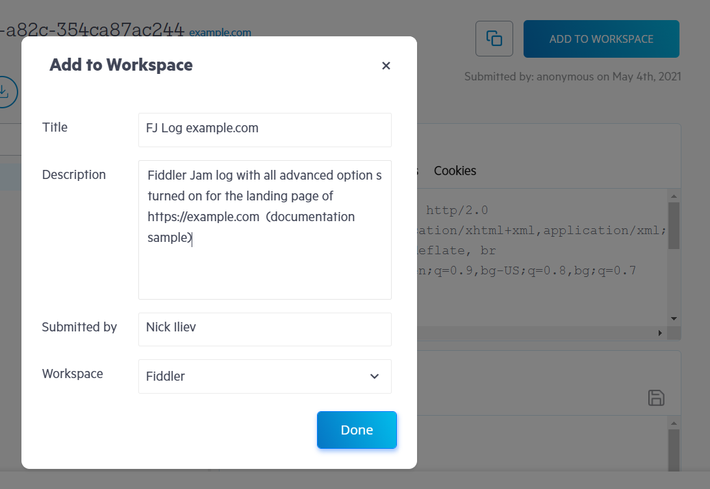

# Workspaces

The Fiddler Jam portal uses workspaces to save and organize the submitted logs. With workspaces, you can manage teams and permissions based on your organization or requirements. Only portal users with the [**agent role**](#agent-role) can create, edit, delete a workspace and add newly submitted logs to an existing workspace. Users with the [**viewer role**](#viewer-role) can only access and review logs added to the account's workspace.

## Create and Rename Workspace

Each Fiddler Jam subscription automatically creates a default workspace for the organization called **_<subscription-type> Workspace_** (for example, **_Trial Workspace_** or **_Pro Workspace_**). 

An agent can rename the default workspace name as follows:

- Select the workspace you would like to edit.
- Click on the **Rename workspace** button at the top-right corner.
- Enter the new workspace name and click on **Rename**.

>tip The current version of the Fiddler Jam dashboard doesn't allow creating additional workspaces. Please [contact us directly](mailto:support@getfiddler.com) if you need to create multiple workspaces.

## Add Submitted Log to Workspace

Any log submitted by an [extension user](##extension-users) is initially accessible based on [the predefined link generation options](). When an agent (with access right) opens the submitted link initially, it won't be part of any workspace. Submitted logs that are not added to a workspace will expire within 30 days. Logs added to an organizational workspace won't expire and can only be removed by the organization's agents.

An agent can add the submitted log to the workspace as follows:

- Use the **Add To Workspace** button in the top-right corner of the dashboard. Note that password-protected logs will require entering the log password before the action is executed.
- Enter the following details:
    1. **Title**: The input will appear as a log title in the workspace log list.
    2. **Description** (_Optional_): The input will appear as a log description in the workspace log list.
    3. **Submitted by**: The input will appear as the log creator alongside the submission date.
    4. **Workspace**: Choose from a drop-down list of existing organizational workspaces.
- Click on **Done**. You will see a confirmation notification, and the log will be loaded in the selected workspace on success. Note that password-protected logs will require entering the log password after the action is executed.
- (Optional) Open the workspace to review the listed new log entry via the **Open Workspace** button or directly continue to work with the submitted log.

