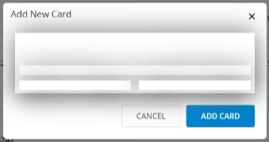

# Fiddler Jam Security

As the Fiddler Jam Chrome Extension captures ongoing tab activities and generates links with the captured activity logs, you need to be careful not to record and then submit any sensitive data as it might pose a threat to your customers.

## Fiddler Jam Security Highlights

When capturing and sharing Fiddler Jam logs, consider the availability of the following security indicators and highlights:

- A red dot will indicate the ongoing recording when the Fiddler Jam Chrome Extension starts capturing.

- When the Fiddler Jam Chrome Extension starts capturing, any [recognizible sensetive data](#recognized-sensitive-data) will be [automatically masked](#masking-sensitive-data).

- When the Fiddler Jam Chrome Extension is [explicitly set to capture a video](#capturing-videos), a screen capturing icon in the recorded tab will indicate the ongoing recording.

- When the Fiddler Jam Chrome Extension is [explicitly set to capture a video](#capturing-videos), any recognizable payment fields (for example, credit card forms) will be automatically [masked in the output video recording](#masking-video).

- If either the [**Capture screenshots**](#take-screenshots-while-capturing) or [**Capture video**](#capture-video) option is enabled, a privacy warning appears before the recording starts.

    

- The Fiddler Jam Chrome Extension captures the content of the Chrome tab in which the capturing was initialized, of all the tabs and windows opened from that particular tab, and all tabs and windows opened from them.

    All tabs and windows with active capturing will have the red dot indication in the Fiddler Jam Chrome Extension and a notification banner at the top of the page reading "Fiddler Jam started debugging this browser". If the red dot and the warning banner are not visible, the Fiddler Jam Chrome Extension is not capturing this browser tab.

- By default, the **Mask cookies** option is enabled. As a result, the Extension will mask cookies values, the masked data will be removed from the captured log, and it will not be possible to read.

- The password-protected logs are client-side encrypted with AES-CTR, and the password is not stored on Fiddler Jam servers.

- The Fiddler Jam team doesn't have access to and can't recover password-protected log content. For more information on password protection in Fiddler Jam, refer to the article on [log sharing options]().

- The Fiddler Jam logs are stored in cloud storage based in the US, North Virginia.

- By default, the Fiddler Jam Portal collects usage statistics data. For more information on enabling and disabling the data collection, refer to the article on the [Fiddler Jam Portal privacy settings](#privacy-settings).

## Recognized Sensitive Data

By design, Fiddler Jam comes with logic for recognizing sets and types of data that might be sensitive and masks them out of the box.

Fiddler Jam regards the following data as sensitive:

1. Data where the `property name` is tested for keywords, which can contain potentially sensitive data, such as: `RSA`, `dsa`, `ed25519`, `ecdsa`, `private`, `key`, `pass`, `pwd`, `secret`, `credential`, `token`, `ssh`, `api-key`, `apikey `, `auth`, `card`, `credit`, `debit`, `MasterCard`, `visa`, `discover`, `diners`, `American.?express` (regular expression that matches any symbol between `American` and `Express`), `Amex`, `carte`, `karte`, `Carta`, `atm`, `Tarjeta`, `CVV`, `verification`, `security`, `transaction`, `Sicherheit`, `Sicurezza`, `seguranca`, and `securite`. The keyword check is case-insensitive.

2. Post data where the `property value` is tested against regex expressions for known credentials, keys, or credit cards, including:

    - Slack Token RSA private key SSH (DSA) private key
    - SSH (EC) private key
    - PGP private key block
    - AWS Access Key ID
    - Amazon MWS Auth Token
    - AWS AppSync GraphQL Key
    - Facebook Access Token
    - Facebook OAuth
    - GitHubToken
    - Generic API Key
    - Generic Secret
    - Google API Key
    - Google Cloud Platform OAuth
    - Google Drive API Key
    - Google Drive OAuth
    - Google Gmail API Key
    - Google YouTube API Key
    - Google YouTube OAuth
    - MailChimp API Key
    - Mailgun API Key* Password in URL
    - PayPal Braintree Access Token
    - Slack Webhook
    - Stripe API Key
    - Stripe Restricted API Key* Square Access Token
    - Square OAuth Secret
    - Telegram Bot API Key
    - Twilio API Key
    - Twitter Access Token
    - Twitter OAuth
    - Master Card
    - American Express
    - Visa Credit card
    - Discover Credit Card  
    - Maestro Credit Card
    - JCB Credit Card
    - Diner's Club Credit Card
    - Amex card  
    - BCGlobal card
    - Carte Blanche Card
    - Insta Payment Card  
    - Korean Local Card
    - Laser card
    - Solo card
    - Switch card
    - Union pay card
    - Vista master card
    - Rupay Debit Card

3. HTTP headers such as:

    - Authorization
    - WWW-Authenticate
    - Proxy-Authorization
    - Proxy-Authenticate

## Masking Sensitive Data

By default, the Jam extension will mask all known-format sensitive data sent to the server or received by the browser. Sent or received data in unknown formats will be considered sensitive, all masked by default. The Extension will remove masked data from the captured logs so that it will not be possible to read. By design, the Jam extension will also mask the recorded video by trying to hide any sensitive data related to payments (for example, credit card numbers, CVC codes, security pings, etc.). [Learn more about masking the video here ...](#masking-video)

The Jam extension will automatically mask (remove) all sensitive data sent to or received from the server contained in one of the following known MIME-type formats:

- `application/json`

- `application/xml`

- `application/x-www-form-urlencoded`

- `multipart/form-data`

- Any that match `text/*`

- Any that match `application/*` and have either the text `json`, `xml`, or `x-www-form-urlencoded` on the right side.

- For all XHR requests that return data in other unsupported MIME types, except those containing the `text/*` pattern, the content is fully masked (removed).

- For all non-XHR request that returns data in other unsupported MIME types, the content is not modified and is left as is.

- For data containing the `text/*` pattern when it can't be parsed to `json`, `xml`, or `x-www-form-urlencoded`, the content is not modified and is left as is.

## Masking Video

When the **Capture Video** option is enabled from the capturing options, the Jam extension will record a video that contains all interactions made by the extension user. By default, the Jam extension will try to recognize any sensitive data related to payments and mask it. As a result, most payment-related forms are explicitly hidden in the outputted video recording. Please note that the Jam video masking does not cover 100% of all real-life cases, so always verify that the recording does not contain sensitive data that you wouldn't want to share.

_Example for automatically masked video (credit card forms are hidden behind white stripes)_

## Secure Usage of the Advanced Options

The [**Advanced Options**]() menu provides some valuable options that Fiddler Jam Extension applies during the capturing.

Before you record a log, consider the following security concerns:

- **Capture video**&mdash;(Enabled by default) The option creates a screencast of the user interactions from the initial browser tab and not from the tabs that were additionally opened. Before recording a log, consider disabling the video recording option if your screen displays sensitive data.

- **Capture screenshots**&mdash;(Enabled by default) The option will add a screenshot of your actions from the active Chrome tab. Before recording a log, consider disabling the screenshot option if your screen displays sensitive data.

- **Capture console**&mdash;(Enabled by default) The option includes all developer console outputs in the recorded log.

- **Capture storage info**&mdash;(Enabled by default) The option captures local (session) storage data from each inspected tab.

- **Mask cookies**&mdash;(Enabled by default) While cookie key names are still readable, the option masks all cookie values so they won't be visible to the portal users who receive the log.

- **Disable cache**&mdash;(Enabled by default) The option sets the `Cache-Control` and `Pragma` headers to a `no-cache` value on each network request.

- **Clear cookies, cache and storage on start**&mdash;(Disabled by default) Clear cookies, cache, and storage of the starting page when the capturing is started.

>tip As per your requirements, always check if the **Capture screenshots** and **Capture video** options are enabled or disabled. When enabled, the options may expose sensitive data (if any) even if that data is masked in the captured HTTP sessions.

## Sharing Links Securely

Once the Fiddler Jam Chrome Extension records a log, it generates a unique link and distributes it as HAR files.

- Logs generated with the **Share as link** option can be opened through the generated and shared link by any Fiddler Jam Portal user.

- Logs generated with the **Share with specific people** option can be opened through the generated and shared link only by Fiddler Jam Portal users who are explicitly included in the share list.

- Logs generated with the **Upload to a workspace** option can be opened through the generated and shared link only by Fiddler Jam Portal users who are part of the specified workspace.

- Logs generated with the **Password protection** option can be opened through the generated and shared link only by Fiddler Jam Portal users who know the password. The Fiddler Jam Chrome Extension distributes the logs as HAR files encrypted with the AES-CTR encryption algorithm.
