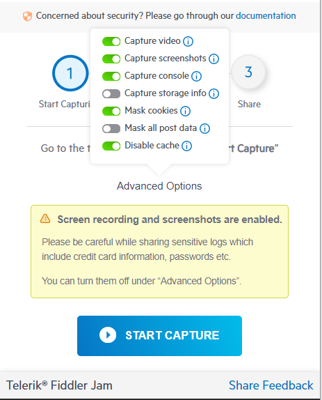

## Fiddler Jam Security

Fiddler Jam extension is a Chrome extension tool that can capture the ongoing tab activity and generate links with the captured activity logs. With such functionality, a particular set of security is added to Fiddler Jam to protect its users' privacy and allow you to share logs with some information being entirely stripped. Here are the must-know highlights when capturing and sharing Fiddler Jam logs.

- When Fiddler Jam starts capturing, a red dot will indicate the ongoing recording.
- When Fiddler Jam is [explicitly set to capture a video](#capture-video), a screen capturing icon in the recorded tab will indicate the ongoing recording.
- If either the [**Take screenshots while capturing**](#take-screenshots-while-capturing) or the [**Capture Video**](#capture-video) options are enabled, a privacy warning appears in hte Fiddler Jam extension before the recording start.
- Fiddler Jam captures the Chrome tab's content where Fiddler Jam capturing is initialized plus all tabs and windows opened from that tab (and all tabs and windows opened from them). All tabs and windows with active capturing will have the red dot indication in the Fiddler Jam extension.
- By default (**Mask all post data** switched off), Fiddler Jam will try to mask sensitive POST data (when the information is in known formats). Data received in an unknown format will be considered sensitive by default and masked at 100%. Switching  **Mask all post data** on will explicitly turn on masking of all POST data. Learn more about [the sensitive data masking and the known formats](#masking-sensitive-data). 
- The default settings (see the [**Capture Options**](#capture-options) below) will mask cookies values.
- The password-protected logs are encrypted with AES-CTR.
- The Fiddler Jam logs are stored in cloud storage based in the US, North Virginia. The Fiddle Jam team doesn't have access to and can't recover password-protected log content. See more about the password-protecting option in the [**Sharing Links**](#sharing-links) option.
- By default, The FiddlerJam portal site is collecting usage statistics data. Learn more about how to enable and disable the collection of usage data via the [Privacy settings](#privacy-settings) 

## Masking Sensitive Data

By default, the Fiddler Jam extension will start capturing with the advanced option **Mask all post data** switched **off**. In that state, the Fiddler Jam extension will try to automatically mask all sensitive post data (data from forms, text inputs, data in the request body sent via POST/PUT/PATCH methods, etc.) that is contained in one of the following known formats (MIME types):

- **application/json**
- **application/xml**
- **application/x-www-form-urlencoded**
- **multipart/form-data**
- any that match __application/*__ and have either the word **json** or **xml** on the right side

Data in other unsupported MIME types or unknown formats is fully masked. 

When the advanced option **Mask all post data** is switched **on**, all post data (including the known formats listed above) is fully masked.

### What is Sensitive Data

Fiddler Jam considers the following as a sensitive data:

1. Post data where the **property name** is tested for keywords that can contain potentially sensitive data such as:
    - rsa, dsa, ed25519, ecdsa which are cryptographic algorithms commonly used for private keys
    - contains the words **private** 
    - contains the word **key**
    - contains the words **pass** or **pwd**
    - cointain the word **secret**
    - contqins the word **credential**
    - contains the word **token**
    - contains the word **ssh**
    - contains the words **api** and **key**
    - contains the word **auth**
    - contains any of the following words: **card|credit|debit|mastercard|visa|discover|diners|american.?express|amex|carte|karte|carta|atm|tarjeta**
    - contains any of the words: **cvv|cvc|verification|security|transaction|sicherheits|sicurezza|seguranca|securite**

2. Post data where the **property value** is tested against regex expressions for known credentials, keys or credit cards including:
    - Slack Token* RSA private key* SSH (DSA) private key
    - SSH (EC) private key
    - PGP private key block
    - AWS Access Key ID
    - Amazon MWS Auth Token
    - AWS AppSync GraphQL Key 
    - Facebook Access Token
    - Facebook OAuth
    - GitHubToken
    - Generic API Key 
    - Generic Secret
    - Google API Key
    - Google Cloud Platform OAuth
    - Google Drive API Key 
    - Google Drive OAuth
    - Google Gmail API Key
    - Google YouTube API Key
    - Google YouTube OAuth
    - MailChimp API Key 
    - Mailgun API Key* Password in URL
    - PayPal Braintree Access Token 
    - Slack Webhook
    - Stripe API Key
    - Stripe Restricted API Key* Square Access Token
    - Square OAuth Secret
    - Teleниgram Bot API Key
    - Twilio API Key
    - Twitter Access Token
    - Twitter OAuth
    - Master Card
    - American Express 
    - Visa Credit card
    - Discover Credit Card  
    - Maestro Credit Card 
    - JCB Credit Card
    - Diner's Club Credit Card 
    - Amex card  
    - BCGlobal card 
    - Carte Blanche Card 
    - Insta Payment Card  
    - Korean Local Card 
    - Laser card 
    - Solo card 
    - Switch card 
    - Union pay card
    - Vista master card 
    - Rupay Debit Card 

3. The following HTTP headers also get masked:
    - Authorization
    - WWW-Authenticate
    - Proxy-Authorization
    - Proxy-Authenticate

## Capture Options

The **Capture Options** menu provides some valuable options that can be applied during the capturing. Before you record a log, consider the following security concerns:

- **Take screenshots while capturing** - This option will add a screenshot of your initial action from the active Chrome tab. Before you record a log, consider disabling the screenshot option if your screen shows sensitive data. **Turned ON by default**.
    >important The taken screenshots might expose sensetive data from the recorded tab. Please be careful while sharing sensitive logs which include credit card information, passwords, etc and share them only with trusted parties. You can turn the option off under [**Advanced Options**](#advanced-options).
- **Capture console** - When active, this option includes any developer's console outputs in the recorded log. Before you record a log, consider disabling this functionality if your console logs contain sensitive information. **Turned ON by default**.
- **Mask cookies** - When active, this option masks all cookies values (cookie key names are still readable!) so that they won't be visible to the portal users receiving the log. **Turned ON by default**.
- **Mask all post data** - When active, this option masks all the POST data (for example, user's information in text inputs and forms). **Turned OFF by default** - learn more about [the default masking of sensitive data](masking-sensitive-data) when this option is turned off.
- **Disable cache** - This option sets the `Cache-Control` and `Pragma` headers to **no-cache** value on each network request. **Turned ON by default**.
- **Capture storage info** - When active, this option captures local/session storage data from each inspected tab. **Turned OFF by default**.
- **Capture video** - When active, this option creates a screencast of the user interactions from the **initial** browser tab (no video is recorded from tabs opened additionally). **Turned OFF by default**.
    >important The video recording might expose sensetive data from the recorded tab (for example, data entered in forms, fields, etc.) will be visible in the recorded video. Please be careful while sharing sensitive logs which include credit card information, passwords, etc and share them only with trusted parties. You can turn the option off under [**Advanced Options**](#advanced-options).

As a security rule of thumb, you should always check if **Take screenshots while capturing** and **Capture video** options are enabled/disabled as per requirements. When those options are enabled, sensitive data might be exposed even if it is masked in the captured HTTP sessions, so take extra care while sharing these logs with third parties. 

 
Use the options **Mask cookies**, and **Mask all post data** to apply an additional masking layer (over the default Fiddler Jam masking) and effectively hide the captured cookies and POST data.

## Sharing Links

Once [a log is recorded](), the Fiddler Jam extension generates a unique link. The logs are distributed as HAR files.

- For logs generated with **Share as link** option:  Any [Fiddler Jam portal users and viewers]() could open the link.
- For logs generated with **Share with specific people** options:  Only [Fiddler Jam portal users and viewers]() that is explicitly included in the share list will be able to open the link.
- For logs generated with **Password protection** option: Only [Fiddler Jam portal users and viewers]() that knows the password could open the link. The logs are distributed as HAR files, which are encrypted with the AES-CTR encryption algorithm.
